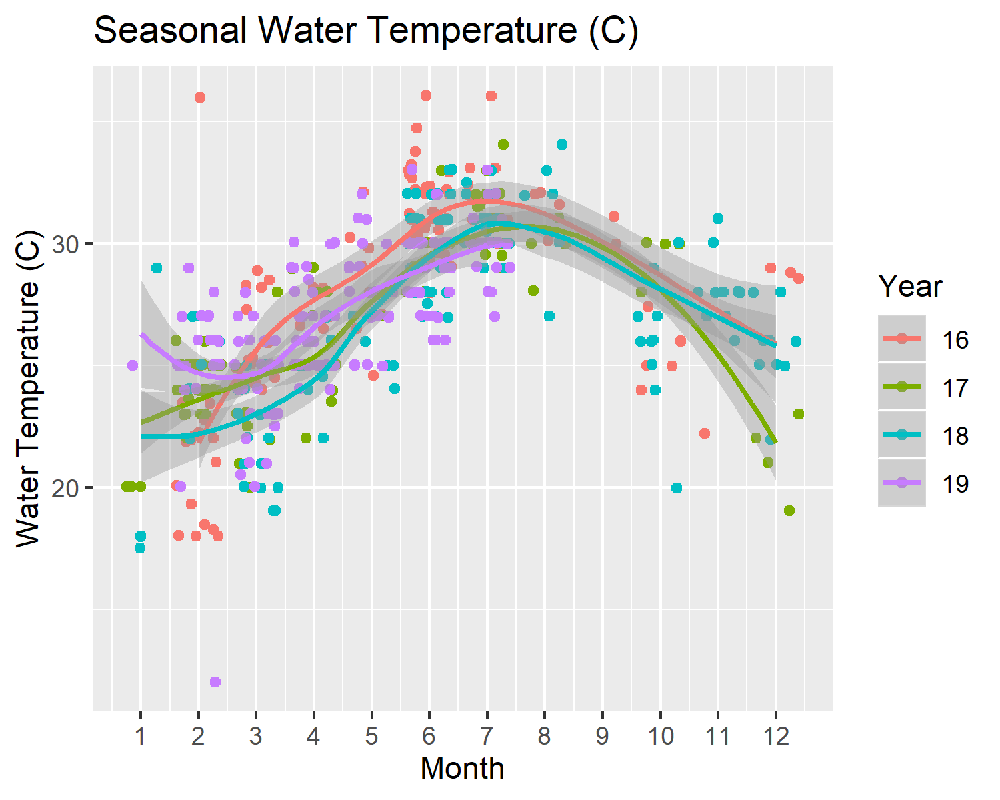
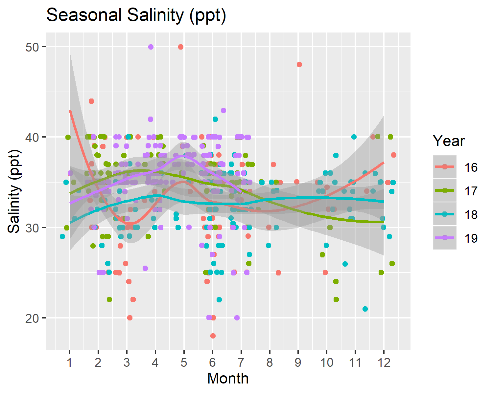
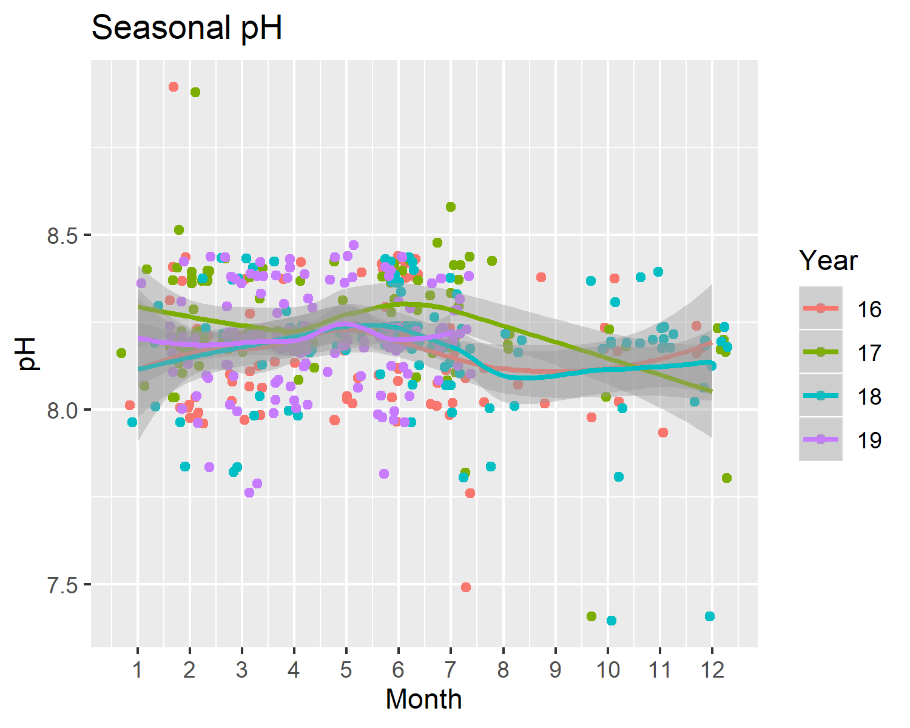
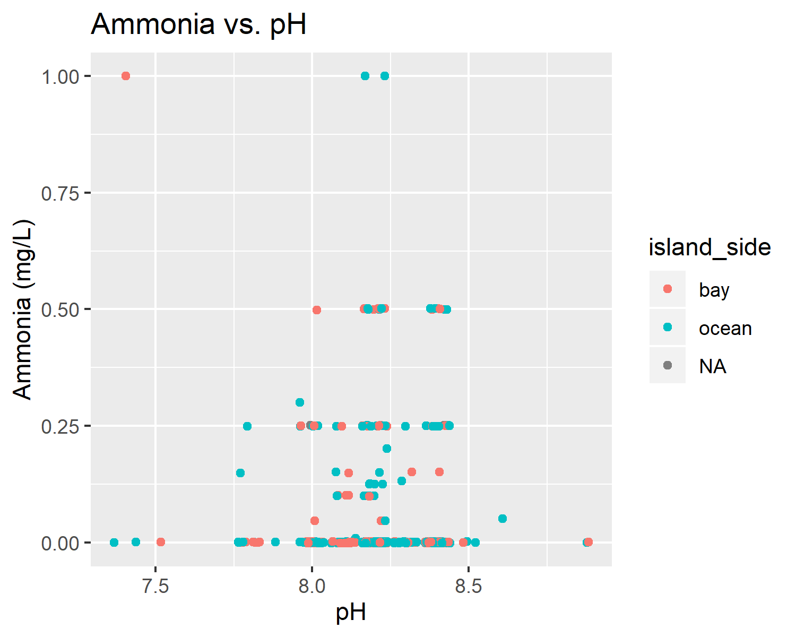

The script contains the supplementary figures files generated by research project "Analysis of citizen science water quality monitoring in Key Largo, Florida." All figure paths are relative to their locations within the project directory. For in depth details of figure creation, evaluation, or additional supporting/testing/evaluation figures please see the embedded coding commentary within script of orgin indicated by the subtitile of the figure section.

```{r add knitr}
library(knitr)
```

## Exploratory Analysis Seasonal

```{r SuppFig1, fig.cap="Seasonal water temperature (C) levels in Key Largo, Florida from 2016-2019.", echo=FALSE}

```


```{r SuppFig2, fig.cap="Seasonal salinity (ppt) levels in Key Largo, Florida from 2016-2019.", echo=FALSE}

```

```{r SuppFig3, fig.cap="Seasonal dissolved oxygen (mg/L) levels in Key Largo, Florida from 2016-2019.", echo=FALSE}
knitr::include_graphics("../../results/Exploratory_Seasonal_Figures/do_seas_lines.png")
```

```{r SuppFig4, fig.cap="Seasonal ammonia (mg/L) levels in Key Largo, Florida from 2016-2019.", echo=FALSE}
knitr::include_graphics("../../results/Exploratory_Seasonal_Figures/ammonia_seas_lines.png")
```

```{r SuppFig5, fig.cap="Seasonal pH levels in Key Largo, Florida from 2016-2019.", echo=FALSE}

```

```{r SuppFig6, fig.cap="Mean monthly water temperature (C) in Key Largo, Florida from 2016-2019.", echo=FALSE}
knitr::include_graphics("../../results/Exploratory_Seasonal_Figures/mean_water_temp_plot.png")
```

```{r SuppFig7, fig.cap="Mean monthly salinity (ppt) in Key Largo, Florida from 2016-2019.", echo=FALSE}
knitr::include_graphics("../../results/Exploratory_Seasonal_Figures/mean_salinity_plot.png")
```

```{r SuppFig8, fig.cap="Mean monthly dissolved oxygen (mg/L) in Key Largo, Florida from 2016-2019.", echo=FALSE}
knitr::include_graphics("../../results/Exploratory_Seasonal_Figures/mean_dissolved_oxygen_plot.png")
```

```{r SuppFig9, fig.cap="Mean monthly ammonia (mg/L) in Key Largo, Florida from 2016-2019.", echo=FALSE}
knitr::include_graphics("../../results/Exploratory_Seasonal_Figures/mean_ammonia_plot.png")
```

```{r SuppFig10, fig.cap="Mean pH in Key Largo, Florida from 2016-2019.", echo=FALSE}
knitr::include_graphics("../../results/Exploratory_Seasonal_Figures/mean_ph_plot.png")
```

## Bivariate Analysis

```{r SuppFig11, fig.cap="Water temperature verses salinity.", echo=FALSE}
knitr::include_graphics("../../results/Bivariate_Figures/temp_and_salt.png")
```

```{r SuppFig12, fig.cap="Water temperature verses pH", echo=FALSE}

```

```{r SuppFig13, fig.cap="Water temperature verses dissolved oxygen", echo=FALSE}
knitr::include_graphics("../../results/Bivariate_Figures/temp_and_do.png")
```

```{r SuppFig14, fig.cap="Water temperature verses ammonia", echo=FALSE}
knitr::include_graphics("../../results/Bivariate_Figures/temp_and_ammonia.png")
```

```{r SuppFig15, fig.cap="pH verses salinity.", echo=FALSE}

```

```{r SuppFig16, fig.cap="Dissolved oxygen verses salinity.", echo=FALSE}
knitr::include_graphics("../../results/Bivariate_Figures/salt_and_do.png")
```

```{r SuppFig17, fig.cap="Ammonia verses salinity.", echo=FALSE}
knitr::include_graphics("../../results/Bivariate_Figures/salt_and_ammonia.png")
```

```{r SuppFig18, fig.cap="Dissolved oxygen verses pH", echo=FALSE}
knitr::include_graphics("../../results/Bivariate_Figures/ph_and_do.png")
```

```{r SuppFig19, fig.cap="Ammonia verses pH.", echo=FALSE}

```

```{r SuppFig20, fig.cap="Dissolved oxygen verses ammonia.", echo=FALSE}

```

```{r SuppFig21, fig.cap="Monthly raster plot of site type and water temperature (C).", echo=FALSE}
knitr::include_graphics("../../results/Bivariate_Figures/raster_by_site_type_temp.png")
```

```{r SuppFig22, fig.cap="Monthly raster plot of site type and salinity (ppt).", echo=FALSE}
knitr::include_graphics("../../results/Bivariate_Figures/raster_by_site_type_sal.png")
```

```{r SuppFig23, fig.cap="Monthly raster plot of site type and dissolved oxygen (mg/L).", echo=FALSE}
knitr::include_graphics("../../results/Bivariate_Figures/raster_by_site_type_do.png")
```

```{r SuppFig24, fig.cap="Monthly raster plot of site type and ammonia (mg/L).", echo=FALSE}
knitr::include_graphics("../../results/Bivariate_Figures/raster_by_site_type_amm.png")
```

```{r SuppFig25, fig.cap="Monthly raster plot of site type and pH.", echo=FALSE}
knitr::include_graphics("../../results/Bivariate_Figures/raster_by_site_type_ph.png")
```

```{r SuppFig26, fig.cap="Mean water temperature over time for the three representative (most frequently visited) sampling sites.", echo=FALSE}
knitr::include_graphics("../../results/Bivariate_Figures/rep_sites_temp.png")
```

```{r SuppFig27, fig.cap="Mean salinity over time for the three representative (most frequently visited) sampling sites.", echo=FALSE}
knitr::include_graphics("../../results/Bivariate_Figures/rep_sites_sal.png")
```

```{r SuppFig28, fig.cap="Mean dissolved oxygen over time for the three representative (most frequently visited) sampling sites.", echo=FALSE}
knitr::include_graphics("../../results/Bivariate_Figures/rep_sites_do.png")
```

```{r SuppFig29, fig.cap="Mean ammonia over time for the three representative (most frequently visited) sampling sites.", echo=FALSE}
knitr::include_graphics("../../results/Bivariate_Figures/rep_sites_amm.png")
```

```{r SuppFig30, fig.cap="Mean pH over time for the three representative (most frequently visited) sampling sites.", echo=FALSE}
knitr::include_graphics("../../results/Bivariate_Figures/rep_sites_ph.png")
```

## Unsupervised Learning Analysis

```{r SuppFig31, fig.cap="Agglomerative cluster analysis of 2016 sampling sites.", echo=FALSE}
knitr::include_graphics("../../results/Unsupervised_Modeling_Figures/good_adend_16.png")
```

```{r SuppFig32, fig.cap="Agglomerative cluster analysis of 2017 sampling sites.", echo=FALSE}
knitr::include_graphics("../../results/Unsupervised_Modeling_Figures/good_adend_17.png")
```

```{r SuppFig33, fig.cap="Agglomerative cluster analysis of 2018 sampling sites.", echo=FALSE}
knitr::include_graphics("../../results/Unsupervised_Modeling_Figures/good_adend_18.png")
```

```{r SuppFig34, fig.cap="Agglomerative cluster analysis of 2019 sampling sites.", echo=FALSE}
knitr::include_graphics("../../results/Unsupervised_Modeling_Figures/good_adend_19.png")
```


