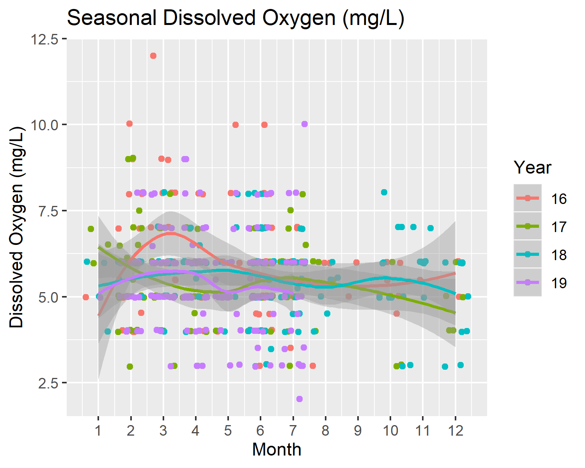
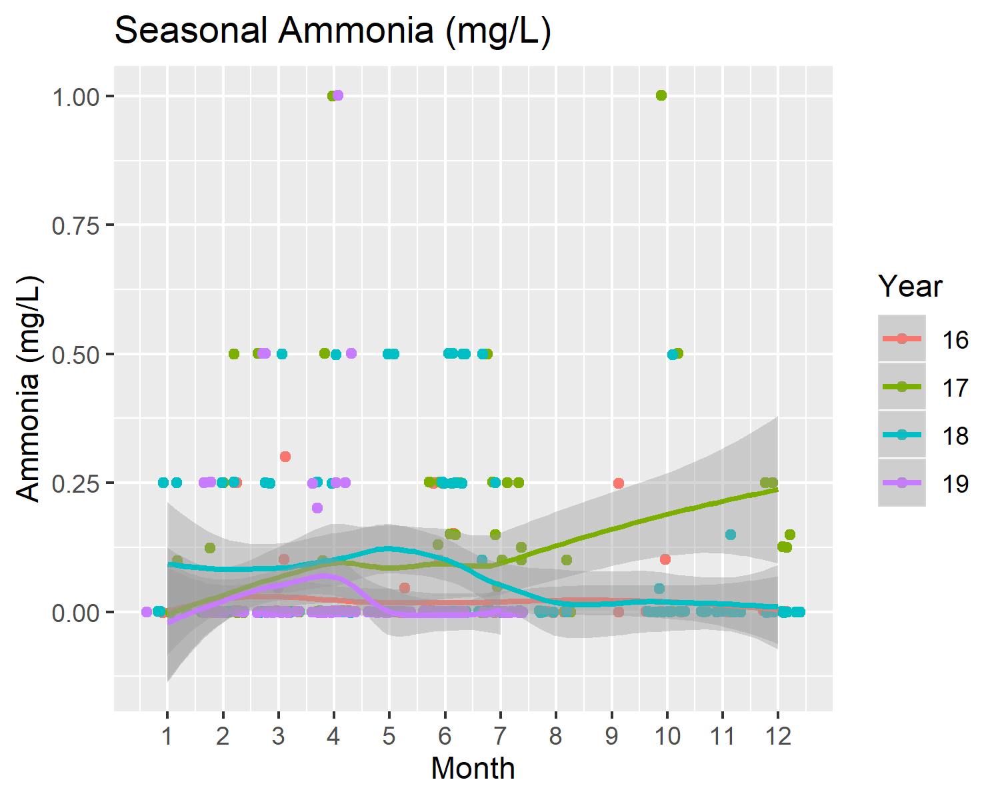
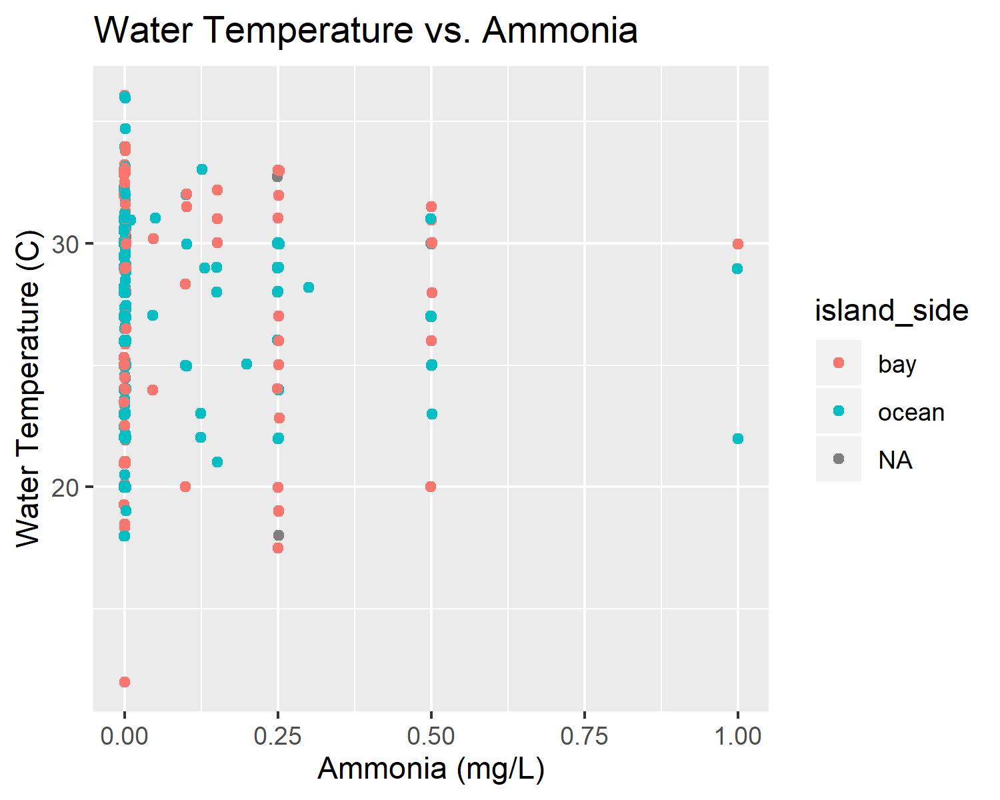
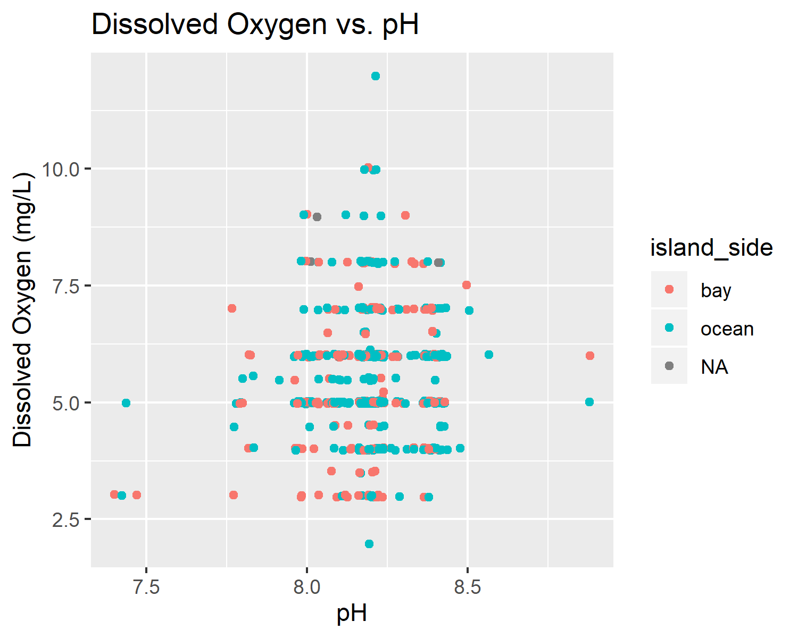

```{r}
library(knitr)
```


```{r SuppFig1, fig.cap=".", echo=FALSE}
knitr::include_graphics("../../results/Exploratory_Seasonal_Figures/water_temp_seas_lines.png")
```


```{r SuppFig2, fig.cap=".", echo=FALSE}
knitr::include_graphics("../../results/Exploratory_Seasonal_Figures/salinity_seas_lines.png")
```

```{r SuppFig3, fig.cap=".", echo=FALSE}

```

```{r SuppFig4, fig.cap=".", echo=FALSE}

```

```{r SuppFig5, fig.cap=".", echo=FALSE}
knitr::include_graphics("../../results/Exploratory_Seasonal_Figures/ph_seas_lines.png")
```

```{r SuppFig6, fig.cap=".", echo=FALSE}
knitr::include_graphics("../../results/Exploratory_Seasonal_Figures/mean_water_temp_plot.png")
```

```{r SuppFig7, fig.cap=".", echo=FALSE}
knitr::include_graphics("../../results/Exploratory_Seasonal_Figures/mean_salinity_plot.png")
```

```{r SuppFig8, fig.cap=".", echo=FALSE}
knitr::include_graphics("../../results/Exploratory_Seasonal_Figures/mean_dissolved_oxygen_plot.png")
```

```{r SuppFig9, fig.cap=".", echo=FALSE}
knitr::include_graphics("../../results/Exploratory_Seasonal_Figures/mean_ammonia_plot.png")
```

```{r SuppFig10, fig.cap=".", echo=FALSE}
knitr::include_graphics("../../results/Exploratory_Seasonal_Figures/mean_ph_plot.png")
```

```{r SuppFig11, fig.cap=".", echo=FALSE}

```

```{r SuppFig12, fig.cap=".", echo=FALSE}
knitr::include_graphics("../../results/Bivariate_Figures/temp_and_ph.png")
```

```{r SuppFig13, fig.cap=".", echo=FALSE}

```

```{r SuppFig14, fig.cap=".", echo=FALSE}

```

```{r SuppFig15, fig.cap=".", echo=FALSE}
knitr::include_graphics("../../results/Bivariate_Figures/salt_and_ph.png")
```

```{r SuppFig16, fig.cap=".", echo=FALSE}

```

```{r SuppFig17, fig.cap=".", echo=FALSE}

```

```{r SuppFig18, fig.cap=".", echo=FALSE}

```

```{r SuppFig19, fig.cap=".", echo=FALSE}
knitr::include_graphics("../../results/Bivariate_Figures/ph_and_ammonia.png")
```

```{r SuppFig20, fig.cap=".", echo=FALSE}
knitr::include_graphics("../../results/Bivariate_Figures/do_and_ammonia.png")
```

```{r SuppFig21, fig.cap=".", echo=FALSE}
knitr::include_graphics("../../results/Bivariate_Figures/raster_by_site_type_temp.png")
```

```{r SuppFig22, fig.cap=".", echo=FALSE}
knitr::include_graphics("../../results/Bivariate_Figures/raster_by_site_type_sal.png")
```

```{r SuppFig23, fig.cap=".", echo=FALSE}
knitr::include_graphics("../../results/Bivariate_Figures/raster_by_site_type_do.png")
```

```{r SuppFig24, fig.cap=".", echo=FALSE}
knitr::include_graphics("../../results/Bivariate_Figures/raster_by_site_type_amm.png")
```

```{r SuppFig25, fig.cap=".", echo=FALSE}
knitr::include_graphics("../../results/Bivariate_Figures/raster_by_site_type_ph.png")
```

```{r SuppFig26, fig.cap=".", echo=FALSE}
knitr::include_graphics("../../results/Bivariate_Figures/rep_sites_temp.png")
```

```{r SuppFig27, fig.cap=".", echo=FALSE}
knitr::include_graphics("../../results/Bivariate_Figures/rep_sites_sal.png")
```

```{r SuppFig28, fig.cap=".", echo=FALSE}
knitr::include_graphics("../../results/Bivariate_Figures/rep_sites_do.png")
```

```{r SuppFig29, fig.cap=".", echo=FALSE}
knitr::include_graphics("../../results/Bivariate_Figures/rep_sites_amm.png")
```

```{r SuppFig30, fig.cap=".", echo=FALSE}
knitr::include_graphics("../../results/Bivariate_Figures/rep_sites_ph.png")
```


