# Summary/Abstract
_Write a summary of your project._


# Introduction 

## General Background Information
Water quality assessment is a core component of experimental design in a wide range of scientific disciplines. Water condition is imperative to environmental and human health, both as a direct concern such as in the case of aquatic organisms or indirectly such as in the case of irrigation of crops[NEW REF]. The utility of water quality data is due to the fact that key parameters can provide information on the baseline health conditon of a water system at a relatively low cost in sampling methodology. The efficacy and cost of water sampling has allowed the techniques to become ubiquitous across the field of environmental science and has become a core component of ecosystem health assessment[@Bertollo2008]. The relative ease of sampling and low cost of materials is particularly useful for research requiring a large number of samples, such as in ecosystem monitoring[@Bertollo2008].

Ecosystem monitoring is the measurement of changes that occur within an ecosystem over time[@Blissetal2001]. Monitoring studies gather data on specific health indicators of interest and use these data to assess long and short-term changes within an ecosystem. Water quality is one of the most common monitoring indicators due to the high level of ecosystem response to changes in water conditions, and the accessibility of methods and equipment. Worldwide programs have been established to gather water quality data though the power of citizen science and outreach. Though a vast amount of data has been collected from various programs, much of the analysis done has been conducted at the state to country scale. Numerous data sets exist at smaller scales which can provide useful information on the local microhabitats of various water systems that may be overlooked when assessed as a larger data set. Here we assess the marine water quality conditions of Key Largo, Florida from 2016 to 2019 through the use of citizen science collected data. 

Key Largo is the northernmost island in the Florida Keys archipelago, and the self-proclaimed "Diving Capital of the World." The waters surrounding Key Largo support three major aquatic habitats: seagrass/mangroves, patch reefs/hardbottom and coral reefs[@Kruczynski2012]. Though distinct in community structure, these three ecosystems exist in delicate balance with one another by means of water-mediating ecosystem functions[@Barnsetal2014]. Key Largo is surrounded on all sides by two major bodies of water: the Florida bay which rests on the Gulf of Mexico side of the island, and the Atlantic Ocean. Florida Bay is a relatively small body of water that extends from the tip of mainland Florida and boarders the west coast of the Upper Florida Keys. The bayside is a relatively shallow enclosed body of water with a dynamic range of abiotic conditions favorable to seagrass and mangrove habitats. The oceanside boasts a substantially deeper and larger body of water with a relatively stable range of abiotic conditions favorable to coral reef and patch reef/hardbottom habitats.

The health of these three major aquatic ecosystems is dependent on the stability of the abiotic conditions of associated waters. Though each of these aquatic habitats are closely associated to the island of Key Largo, chemical and geographical conditions differ between systems and thus support considerably different community structures. Adequate monitoring of these coastal water systems is imperative to the continued environmental and economic health of the island. Citizen science data collection enables researchers to collect information at a substantially larger scale than would be possible alone. The analysis of these data will be used to establish a baseline health condition for various water bodies associated with Key Largo; and will produce data visuals to enrich future citizen science programs. 

## Description of data and data source
These data are water quality measurements collected in Key Largo, Florida by the Marine Resources Development Foundation from 2016 to 2019. The Marine Resources Development Foundation is an environmental education non-profit that provides an immersive marine science field experience for students ranging from fourth grade to undergraduates. Marinelab students take a variety of courses to educate them about the local ecosystems and complement their laboratory and classroom time with daily field trips to the ecosystem of interest. Many courses within the Marinelab curriculum contain integrative data collection programs which task students with the collection of citizen science data on the health of local ecosystems. All data is collected in the field on paper data sheets and is entered into a master raw database by a Marinelab staff members. Specific subsets of citizen science data collected through the programs are passed onto other monitoring agencies for further processing based on individual need and interest.

These data are raw water quality data collected from various sampling sites frequented by Marinelab vessels. Water quality data is characterized by 11 distinct variables: date, time, location, instructor name, group name, pH, ammonia, dissolved oxygen, water temperature, salinity, and equipment. The variables: date, time, location, instructor name, group name, and equipment are all clerical data which provide information on the measuring techniques and site characteristics of a sample. The variables: pH, temperature, dissolved oxygen, salinity, and ammoina are water quality parameters used to assess the abiotic conditions of the sample site. The Marine Resources Development Foundation has a desire to learn the large-scale patterns of the local water quality to better educate students enrolled in the program. Though this data has been collected for some time, no formal analysis of the data has ever been conducted at a large-scale with the master data. 

## Questions/Hypotheses to be addressed

_Question 1: Ocean Verses Bay_

What are the major differences in water quality parameters between Oceanside and Bayside site locations?

_Question 2: Change Over Time_

Have the water quality conditions of sampling sites changed over the three years of observation, and can we see impacts of hurricane Irma on the expected conditions?

_Question 3: Seasonal Change_

Are there notable seasonal changes in the abiotic conditions of the water?

_Question 4: Citizen Science Data Efficacy_

Is citizen science data accurate enough to capture large-scale environmental trends and is the data specific enough to characterize different aquatic habitat types.

_Question 5: Data Clustering_

How are sampling sites grouped in terms of water quality measures? 
Are there any site-wise, annual, and/or seasonal patterns that can be identified from these grouping patterns?

_Objective 6: Promoting Future Citizen Science_

Develop a script for the immediate processing of data collected by groups actively in the Marinelab program. The goal of this objective is to write a ready-to-use script that will produce boxplot plots of the five water quality parameters to compare and contrast island side and site type between locations. These figures will then be used to show students the results of their data collection over the course of their time at Marinelab. The script will be tailored to accept a specifically formatted .xlsx file to ensure the data can be run with minimal to no cleaning required. Detailed instructions for data entry into the .xlsx file, and instructions for loading and running the script can be found in the README.md file in the _code_ folder.

# Methods

## Field Methods
All data was collected by students or instructors of the Marinelab environmental education program. All collectors are required to complete a one-hour training program to familiarize themselves with the testing materials and data recording before they are permitted to work in the field. Data is collected in the field at various sampling locations dictated by the needs of the program, accessibility of location, and weather conditions. On site, a grab sample of water is collected and brought onto the vessel for testing. Abiotic conditions are measured immediately following collection and scored onto a paper record sheet. All measures are taken using semiquantative testing equipment or with a YSI Sonde. Temperature is measured in Celsius using a standard thermometer attached to a string to ensure body heat does not skew the data. Salinity is measured with a standard hydrometer and/or refractometer in ppt. Dissolved Oxygen is measured using a colormetric ampoule analysis in mg/L. Ammonia and pH are both measured using standardized test kits contiaing test strips and reagent solution respectively. All data sheets are collected and entered into the master database upon return to shore. 

## Analysis Methods
All data was processed and analyzed using R Studio software. Individual components of processing or analysis are broken into eight distinct scripts to clean raw data and address the major objectives of the study.

#### Data Acquisition
The raw citizen science data was acquired from the Marinelab citizen science master database. The database is privately maintained by the Marine Resources Development Foundation and is not readily available online. Data is primarily used as a tool to enrich scientific education in the Marinelab program; however data may be distributed for analysis at the discretion of the director of the program. This analysis was conducted under the permission of the current Marinelab director Sarah Egner, and the resulting analysis will be used for the enrichment of future programs. 
The raw Florida Keys National Marine Sanctuary (FKNMS) data was aquired from FKNMS Water Quality Protection Program metadata repository and is freely available online. A link to this metadata repository can be found in the supplemental materials. 

#### Data Import and Cleaning
All raw data was imported as xlsx files and cleaned for optimal analysis in R. Raw citizen science data was organized to improve data interpretability and visualization. New variables were added to this dataset to create comparable categorical subgroups based on the sampling location of the observation. Citizen science processing code can be found in the project repository under the WQprocessing.Rmd file. Raw FKNMS data was subsetted to isolate replicate sampling locations to the citizen science data and cleaned for optimal analysis in R. FKNMS processing is acomplished as a component of the citizen_science_efficacy_analysis.Rmd script located within the project directory. 

#### Promoting Future Citizen Science
To facilitate the efforts of MarineLab and future citizen science interests, a ready-to-use shell processing/analysis script and a complementary raw data shell were designed. This shell and script allow for the rapid visualization of collected data which can be used to educate students who participate in citizen science water quality monitoring. Components and instructions for the usage of this script can be found in the supplemental materials.

#### Exploratory/Univariate Analysis
Exploratory analysis of the citizen science data investigated the general distribution of water quality parameters and was broken into two subgroups, location analysis and seasonal analysis. Exploratory location analysis measured the water quality conditions based on island side and site type of the sampling location. Island side was broken into two distinct categories: ocean side (Atlantic) and bay side (Gulf of Mexico). Site type was split into three categories: Seagrass/Mangrove, Patch Reef/Hardbottom, and Coral Reef. Island side was determined based on the geographic location of the site in relation to the island of Key Largo and site type was determined by the dominat benthic species of the location. Exploratory seasonal analysis visualized the long-term patterns of water quality conditions across the four years of data collection. Each water quality parameter was averaged and plotted against the total time of the study to determine seasonal fluctuations. It should be noted that due to accessibility contstraints/facility closures the months of August and December have a reduced total number of observations compared to the remaining months. This data was compiled in August of 2019 and thus the fall season of this year is excluded from this study. 

#### Bivariate Analysis
Bivariate analysis measured the correlations between the individual water quality parameters themselves and investigated the deeper associations of seasonal trends. Comparative analysis was used to determine correlations between pairs of water quality parameters. Seasonal data series were created for each year of study and compared across a monthly timescale to visualise specific seasonal changes for all years of study.


#### Hurricane Irma Analysis
Hurricane Irma analysis investigated the water quality effects of the September 10, 2017 landfall of Hurricane Irma in the Florida Keys. A hurricane-influenced data subset was created and the time series data was visualized to show changes in the baseline water quality parameters in response to storm landfall. Hurricane-influenced data was compared to non-influenced data using a Two-sample Kolmogorov-Smirnov test to determine if the hurricane had any significant effects on the water quality following landfall.

#### Citizen Science Efficacy Analysis
Citizen science efficacy analysis compared the water quality measures collected through citizen science monitoring to professionally collected water quality data by the FKNMS. Water quality parameters were compared using common sampling sites with at least 20 recorded observations from both datasets. Site comparison was done using: Tarpon Basin, Grecian Dry Rocks, Key Largo Dry Rocks, Molasses, and Rodriguez Key. Grecian Dry Rocks, Molasses, and Key Largo Dry Rocks all represented a coral reef site type. Tarpon Basin represented a seagrass/mangrove habitat site and Rodriguez Key represented a patch reef/hardbottom site. Comparative analysis of pH measures was unable to be conducted due to insufficent pH data in the FKNMS database. 

#### Unsupervised Learning Analysis
Agglomerative hierarchical cluster analysis was used to determine how individual sampling sites were grouped in terms of the water quality condition. Systematic subsetting of cluster data was used to investigate the patterns of grouping within specific site types, sampling months, and years of measurement. Dendrograms of cluster analysis were constructed using Ward's minimum variance method and ideal cluter values were assessed using the silhouette and within-cluster sum of squares metrics. Tanglegrams were used to compare dendrogram similarity and entanglemnt was computed as a metric of similarity. Cluster analysis was broken into three groups: total cluster analysis, site type cluster analysis, and representitive site seasonal cluster analysis. Total cluster analysis grouped all of the sampling sites from all years of study. Site type cluster analysis explored the similarity and dissimilarity of sampling locations within each of the three major site types. Representitive site seasonal cluster analysis compared the month-wise grouping three most frequently visited sites (one of each type) in the study.

## Results

### Exploratory/Univariate analysis
Exploratory analysis showed the general trends of water quality contitions within categorical location groups and across the time series of the study. Location analysis showed abiotic water quality conditions of sampling sites based on island side and site type. Water temperature showed a consistent average for both ocean and bay side site locations near 29 degrees and a wider ranger of temperature measures in bay side locations. When compared by site type, both coral reefs and patch reef/hardbottom sites exhibit stenothermal themperature distributions whereas seagrass/mangrove habitats are more eurythermal. The greatest temperature average was seen in path reefs/hardbottom sites. Temperature results can be viewed in Figure 1. Salinity showed a similar location-based distribution with a wider salinity range seen in bay side sites and a greater average salinity (35ppt) on the ocean side. Coral reefs and patch reefs/hardbottom sites showed a similar stenohaline distrubution whereas seagrass/mangrove locations were more euryhaline. The results of salinity can be viewed in Figure 2. Dissolved oxygen measures did not show any notable patterns of location-based changes beyond small differences in outlier measures for both island side and site type comparisons. The reuslts of dissolved oxygen can be viewed in Figure 3 below. Ammonia measures were infrequently above zero and show no discernable pattern based on island side. Site type comparison shows a slight increase in the ammonia for seagrass/mangrove sites. Ammonia results can be viewed in Figure 4. pH measures did not show any discernable patterns of location-based changes in concentration across island side and site type. pH results can be viewed in Figure 5. 

```{r 1Fig, fig.cap="Water temperature (C) distribution comparison of island side and site type sampling locations in Key Largo, Florida.", echo=FALSE}
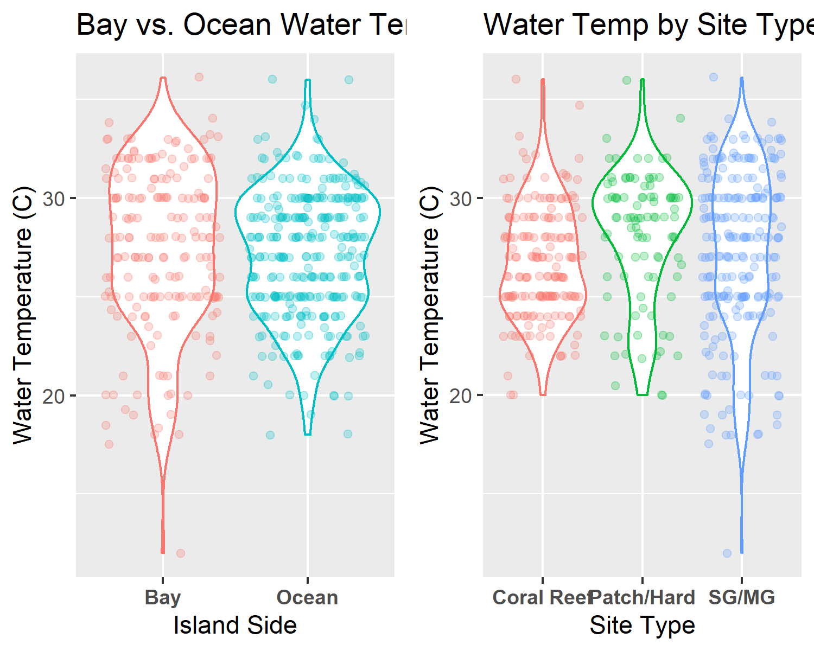

```

```{r 2Fig, fig.cap="Salinity (ppt) distribution comparison of island side and site type sampling locations in Key Largo, Florida.", echo=FALSE}
knitr::include_graphics("../../results/Exploratory_Location_Figures/sal_wrap_manuscript.png")
```

```{r 3Fig, fig.cap="Dissolved oxygen (mg/L) distribution comparison of island side and site type sampling locations in Key Largo, Florida.", echo=FALSE}
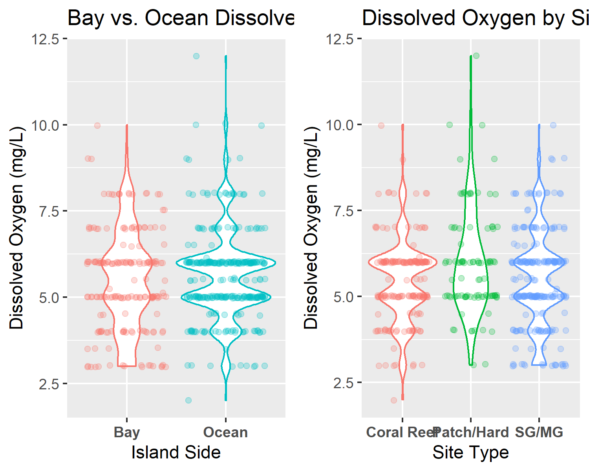

```

```{r 4Fig, fig.cap="Ammonia (mg/L) distribution comparison of island side and site type sampling locations in Key Largo, Florida.", echo=FALSE}
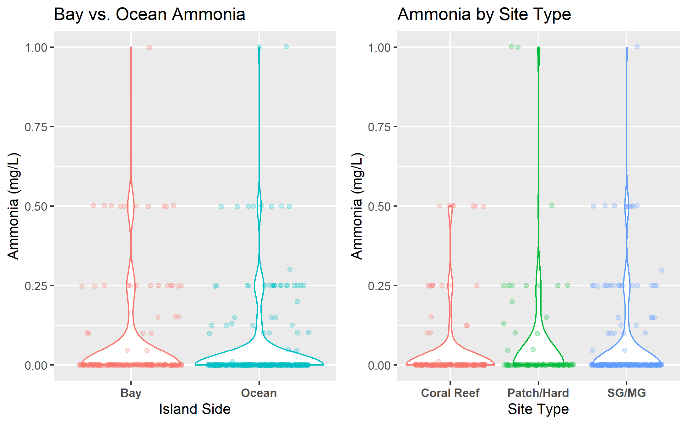

```

```{r 5Fig, fig.cap="pH distribution comparison of island side and site type sampling locations in Key Largo, Florida.", echo=FALSE}
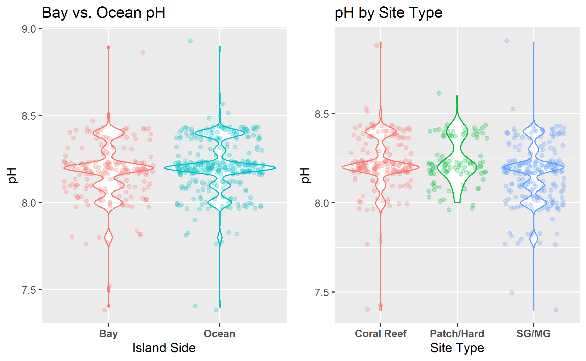

```


Seasonal analysis visualized the general timescale trends in all water quality parameters averaged across the four years of study. This analysis revealed a  fluctuation in the mean water temperature consistent with the occurance of the seasons. Dissolved oxygen measures showed a similar overall pattern of fluctuation however, this pattern was inconsistent with seasonal trends. All remining water quality parameters showed inconsistent patterns of increase and decrease which will be discussed in further analyses. Annual fluctuation results can be viewed in Figure 6.

```{r 6Fig, fig.cap="Annual fluctuation of water quality parameters in Key Largo, Florida from January 2016 to August 2019.", echo=FALSE}
knitr::include_graphics("../../results/Exploratory_Seasonal_Figures/combined_seasonal_trends.png")
```


### Bivariate Analysis

Comparative analysis of the associations between each of the five water quality parameters show no discernable associations between variables that are distinct from the results of the above univariate analysis. The various patterns associated with island side and site type can be visualized in the bivariate comparisions of these parameters, however no novel correlations were observed. All comparative analysis figures can be viewed in the supplementary data folder of the project. 

Bivariate analysis permitted the in depth visualization of all five water quality parameters across the annual time scale allowing for a detailed view of the seasonal water conditions for bay and ocean side sites. Analysis of water temperature showed distinct seasonal patterns of temperature rise an fall consistent with cooler and warmer months of the year. For all four years of study, bayside site locations showed a greater temperature range when compared to oceanside sites, consistent with the findings of univariate analysis. Bivariate water temperature analysis can be viewed in Figure 7. Salinity showed a distinctive seperation of bay side and ocean side waters with measures typically greater in the ocean (35ppt average) and reduced in the bay (32ppt average). Bayside site locations showed a much wider range of salinity conditions whereas the ocean was relatively stenohaline. There is a distinct jump in the salinity of bayside site locations in 2016 and 2019 associated with the months of March and April. 2017 showed a distinctive drop in the salinity of the bay associated with the month of September. Bivariate salinity results can be viewed in Figure 8.


```{r 7Fig, fig.cap="Seasonal water temperature (C) of ocean and bayside site locations in Key Largo, Florida.", echo=FALSE}
knitr::include_graphics("../../results/Bivariate_Figures/temp_by_year.png")
```


```{r 8Fig, fig.cap="Seasonal salinity levels (ppt) of ocean and bayside site locations in Key Largo, Florida.", echo=FALSE}
knitr::include_graphics("../../results/Bivariate_Figures/sal_by_year.png")
```
 
Analysis of dissolved oxygen did not show any distinct seasonal patterns in the oxygen levels of Key Largo waters. Bayside sites typically showed a lower minimum dissolved oxygen level, whereas the max was variable between the two island sides. The results of bivariate dissolved oxygen analysis can be viewed in Figure 9. Ammonia analysis did not show any consistent seasonal fluctuation patterns across all years of measure. Levels on both the bay side and ocean side remain relatively low through the course of study with small intermittant spikes occasionally. There is a substantial spike in bay and ocean side ammonia levels in 2017 coinciding with the late summer to early fall. The results of bivariate ammonia analysis can be viewed in Figure 10. Analysis of pH levels showed no discernable seasonal fluctuations. pH remained relatively constant at both bay side and ocean side site locations. The minimum and maximum pH levels did not show any distinct patterns between island sides. The results of bivariate pH analysis can be viewed in Figure 11.


```{r 9Fig, fig.cap="Seasonal dissolved oxygen levels (mg/L) of ocean and bayside site locations in Key Largo, Florida.", echo=FALSE}
knitr::include_graphics("../../results/Bivariate_Figures/do_by_year.png")
```


```{r 10Fig, fig.cap="Seasonal ammonia levels (mg/L) of ocean and bayside site locations in Key Largo, Florida.", echo=FALSE}
knitr::include_graphics("../../results/Bivariate_Figures/amm_by_year.png")
```


```{r 11Fig, fig.cap="Seasonal pH levels of ocean and bayside site locations in Key Largo, Florida.", echo=FALSE}
knitr::include_graphics("../../results/Bivariate_Figures/ph_by_year.png")
```

### Hurricane Irma Analysis

Hurricane Irma analysis investigated the specific impacts of hurricane Irma landfall on the five water quality parameters measured in this study. Figures in this analysis represent continious time data from the start of 2017 to the end of 2018 to allow visualization of the acute and subacute effects of hurricane landfall. 

Water temperature associated with Irma landfall showed a notable decline three months following the storm. This drop was greatest in bayside site locations. It should be noted this decrease is consistent with the timing and patterns of standard seasonal fluctuation of water temperature in the Florida Keys observed through bivariate analysis. The results of Hurrican Irma water temperature effects can be viewed in Figure 12. Salinity levels associated with hurricane landfall showed a sharp decrease for bayside site locations immediately following the storm which persisted for 1-2 months before stablizing back to a standard level. The mean salinity of the ocean remained relatively constant following the storm. The results of Hurricane Irma salinity effects can be viewed in Figure 13.

```{r 12Fig, fig.cap="Influence of Hurricane Irma landfall on the mean water temperatures (C) of ocean and bayside waters of Key Largo, Florida. Hurricane Irma landfall occured on September 10, 2017 (indicated by dashed line).", echo=FALSE}
knitr::include_graphics("../../results/Hurricane_Irma_Figures/imra_mean_temp_plot.png")
```


```{r 13Fig, fig.cap="Influence of Hurricane Irma landfall on the mean salinity levels (ppt) of ocean and bayside waters in Key Largo, Florida. Hurricane Irma landfall occured on September 10, 2017 (indicated by dashed line).", echo=FALSE}
knitr::include_graphics("../../results/Hurricane_Irma_Figures/imra_mean_sal_plot.png")
```

Dissolved oxygen levels associated with hurricane landfall did not show any notable changes for both bayside and oceanside site locatons. There is a distinct decrease in the mean dissolved oxygen for the bay observed in the latter months of 2018. The results of Hurricane Irma dissolved oxygen effects can be viewed in Figure 14. Ammonia levels associated with Hurricane Irma showed a dramatic spike in bayside site locations immediately following landfall and a slight increase for oceanside sites. The large spike in bayside ammonia appears to return to baseline levels by the spring of 2018 however, this return is immediately followed by a second spike in subsequent months. The results of Hurricane Irma ammonia effects can be viewed in Figure 15. pH levels associated with hurricane landfall showed a moderate drop in bayside site levels immediately following the storm. This decrease is consistent with the acute timeline of hurricane landfall however, the drop is not substantially different from standard fluctuations of the bayside pH observed in the bivariate analysis. The results of Hurricane Irma pH effects can be viewed in Figure 16.


```{r 14Fig, fig.cap="Influence of Hurricane Irma landfall on the mean dissolved oxygen levels (mg/L) of ocean and bayside waters in Key Largo, Florida. Hurricane Irma landfall occured on September 10, 2017 (indicated by dashed line).", echo=FALSE}
knitr::include_graphics("../../results/Hurricane_Irma_Figures/imra_mean_do_plot.png")
```


```{r 15Fig, fig.cap="Influence of Hurricane Irma landfall on the mean ammonia levels (mg/L) of ocean and bayside waters in Key Largo, Florida. Hurricane Irma landfall occured on September 10, 2017 (indicated by dashed line).", echo=FALSE}
knitr::include_graphics("../../results/Hurricane_Irma_Figures/imra_mean_amm_plot.png")
```


```{r 16Fig, fig.cap="Influence of Hurricane Irma landfall on the mean pH levels of ocean and bayside waters in Key Largo, Florida. Hurricane Irma landfall occured on September 10, 2017 (indicated by dashed line).", echo=FALSE}
knitr::include_graphics("../../results/Hurricane_Irma_Figures/imra_mean_ph_plot.png")
```


Water quality parameters from September-Febuary from 2017-2018 were compared to measures from 2016-2017 using a Two-sample Kolmogorov-Smirnov test to determine if any of the five parameters were significantly significant. The results of the Kolmogorov-Smirnov test showed a p-value of 0.227 for water temperature, 0.002 for salinity, 0.499 for dissolved oxygen, 0.002 for ammonia, and 0.334 for pH. These results suggest that the salinity and ammonia levels were siginifcantly influenced by the landfall of Hurricane Irma. This significance is consistent with the visuals produced from univariate, bivariate, and Hurricane Irma analysis. 

### Citizen Science Efficacy Analysis
Citizen science efficacy analysis compared the MarineLab citizen science water quality data to measures collected through the FKNMS water quality monitoring program. Comparison of water temperature measures showed similar patterns of temperature range for all sites. Minor fluctuations in the interquartile range and median values are seen across the comparison however, no distinct pattern of variaton is discernable. Comparative water temperature results can be viewed in Figure 17. Comparative salinity analysis showed a distinctive decrease in the size of the interquartile range of salinity measures for FKNMS observations compared to citizen science observations.Both FKNMS and citizen science show Tarpon Basin to have the largest range of salinity which is consistent with the findings of the bivariate analysis. The resuts of comparitave salinity analysis can be viewed in Figure 18.

```{r 17Fig, fig.cap="Comparative analysis of water temperature (C) measures collected from citizen science data verses FKNMS data.", echo=FALSE}
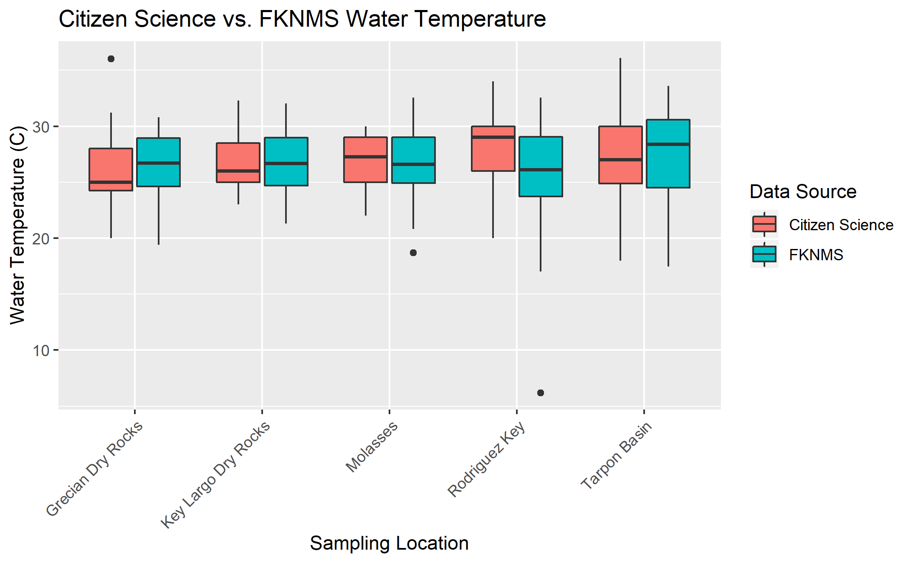
```

```{r 18Fig, fig.cap="Comparative analysis of salinity (ppt) measures collected from citizen science data verses FKNMS data.", echo=FALSE}
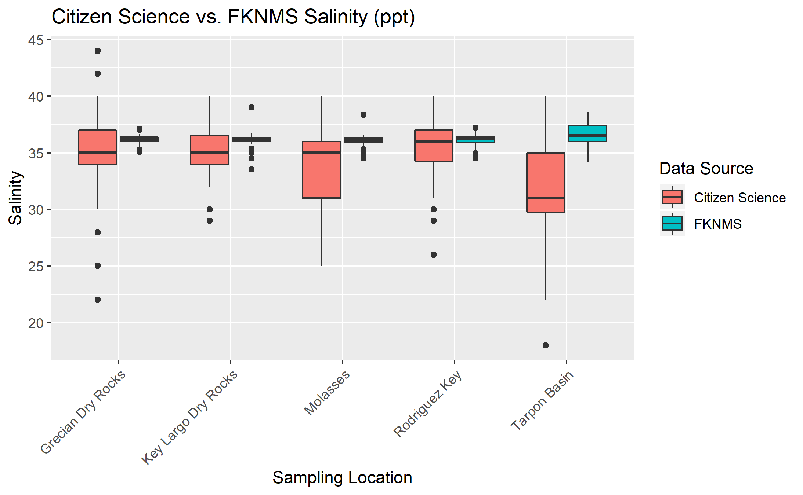
```

Comparative analysis of dissolved oxygen shows a relatively consistent pattern across both data sources. The upper limits of the interquartile range for citizen science observations is typically consistent with the median value for FKNMS data showing a small bias toward recuded dissolved oxygen levels in citizen science measures. The results of comparative dissolved oxygen analysis can be viewed in Figure 19. Comparative analysis of ammonia observations shows a distinctly higher level in measured in FKNMS data when compared to citizen science data. The interquartile range of citizen science measures for all sites rest entirely at the 0 mg/L level whereas, FKNMS data shows a slightly larger range from 0-0.5 mg/L. Interestingly, the FKNMS observations show a greater number of high outliers compared to no high level outliers in the citizen science data. The results of comparative ammonia analysis can be viewed in Figure 20.  

```{r 19Fig, fig.cap="Comparative analysis of dissolved oxygen (mg/L) measures collected from citizen science data verses FKNMS data.", echo=FALSE}
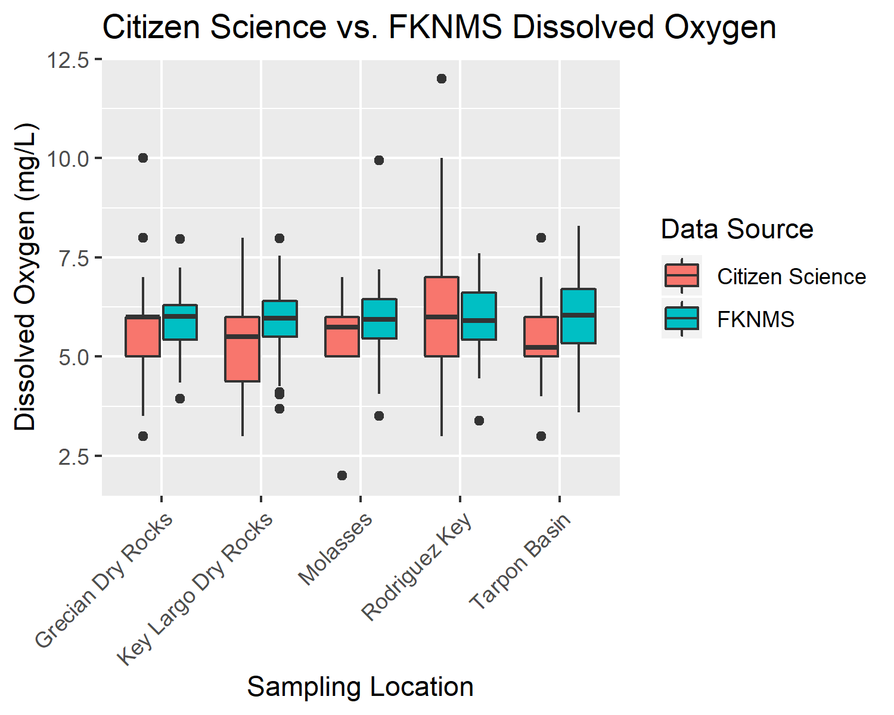
```

```{r 20Fig, fig.cap="Comparative analysis of ammonia (mg/L) measures collected from citizen science data verses FKNMS data.", echo=FALSE}
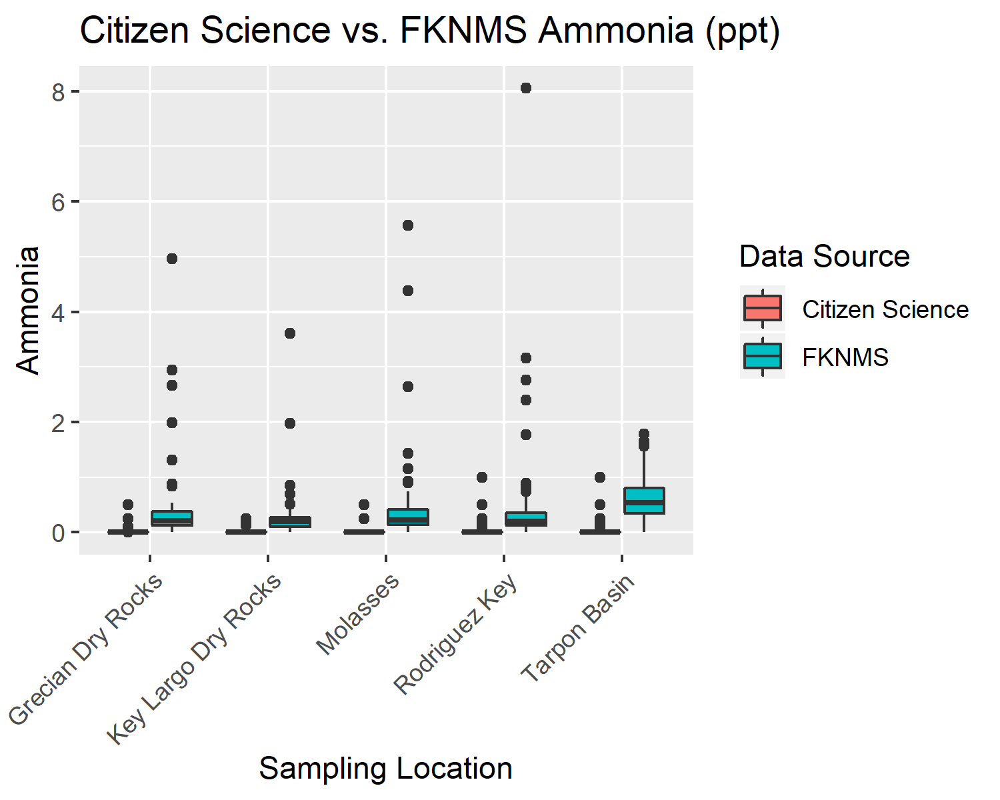
```


### Unsupervised Learning Analysis
Unsupervised learning analysis used agglomerated hierarchical clustering to determine the grouping characteristics of sampling sites based exclusively on water quality parameters. The overall results of this analysis showed largely that clustering at the lowest levels of the dendrogram (most similar) and the highest levels of the dendrogram (least similar) were often consistent with other components of site characteristics such as: geographical location, water depth, and benthic biotic commiunity structure. The mid-levels (moderate similarity) of the dendrograms were typically highly variable and not consistent with any known patterns of site characteristics. The total cluster analysis dendrogram split into 5 distinct clusters by water quality. The majority of coral reef site locations were clustered into a single group (purple in Figure 21). The remaining 4 clusters showed a mixture of seagrass/mangrove, patch reefs/hardbottom, and two coral reef locations. The reef site known as The Elbow was notably clustered into a group by itself. The dendrogram of all sampling sites can be viewed in Figure 21.

```{r 21Fig, fig.cap="Total Cluster Analysis Dendrogram: Agglomerative hierarchical clustering using the agnes algorithm, Ward's minimum variance, and silhouette cluster validation.", echo=FALSE}
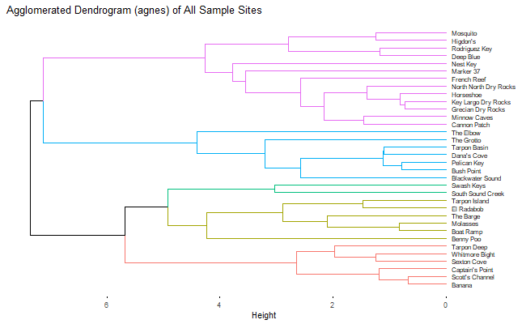
```

Site type cluster analysis seperated sampling locations by site type to visualize patterns of grouping within types. Seagrass/mangrove cluster analysis showed a fairly diverse grouping with locations splitting into 5 clusters. Many of most closest related pairs were geographically close locations (Pelican Key & Bush Point, Tarpon Basin & Dana's Cove, El Radabob & Boat Ramp). Notably, the most geographically distant location Nest Key was clustered into a solo group. The results of seagrass/mangrove site clustering can be viewed in Figure 22. Patch reef/hardbottom cluster analysis showed the most diverse grouping of all three site types splitting into 6 clusters. All sampling locations within this subset were assigned with individual cluster groups with the exception of two: Mosquito and Higdon's. The results of patch reef/hardbottom cluster analysis can be viewed in Figure 23. Coral reef cluster analysis showed the lowest diversity splitting into 2 cluster groups. The smaller cluster (blue in Figure 24) contained the two northernmost reef sites The Elbow and Ocean Reef Club, where as the second cluster (red in Figure 24) contained all mid-southern sites. Similarly to seagrass/mangrove clustering the most closely related pairs (Horseshoe & Grecian Dry Rocks, North North Dry Rocks & Key Largo Dry Rocks) were geographically close. The results of coral reef cluster analysis can be viewed in Figure 24.


```{r 22Fig, fig.cap="Seagrass/Mangrove Site Type Cluster Analysis Dendrogram: Agglomerative hierarchical clustering using the agnes algorithm, Ward's minimum variance, and silhouette cluster validation.", echo=FALSE}
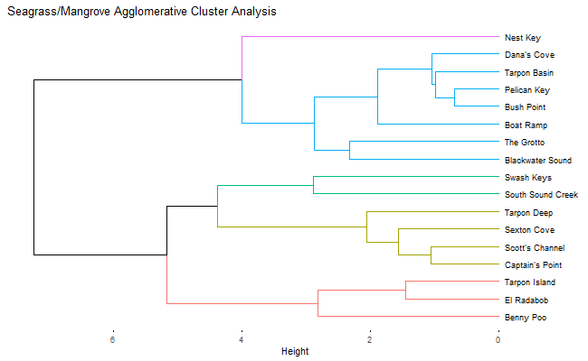
```

```{r 23Fig, fig.cap="Patch Reef/Hardbottom Site Type Cluster Analysis Dendrogram: Agglomerative hierarchical clustering using the agnes algorithm, Ward's minimum variance, and silhouette cluster validation.", echo=FALSE}
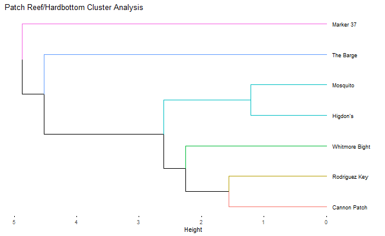
```

```{r 24Fig, fig.cap="Coral Reef Site Type Cluster Analysis Dendrogram: Agglomerative hierarchical clustering using the agnes algorithm, Ward's minimum variance, and silhouette cluster validation.", echo=FALSE}
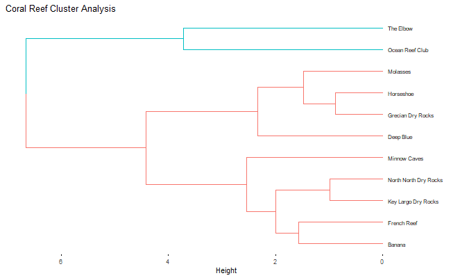
```

Representitive site seasonal cluster analysis compared the seasonal grouping of observations from each of the three representitive sites (most frequently visited) in the study: Tarpon Basin as seagrass/mangrove, Rodriguez Key as patch reef/hardbottom, and Grecian Dry Rocks as a coral reef. The results of Tarpon Basin seasonal analysis produced a dendrogram with 2 clusters. All months were containd within a single cluster with the exception of October which was the only fall month included in this analysis. Additionally, the pattern of closely-related pairs was consistent with seasonal groupings of the months of th year. The results of Tarpon Basin cluster analysis can be viewed in Figure 25. Rodriguez Key seasonal cluster analysis produced a dendrogram with 4 clusters. All summer months were grouped within the same cluster (purple in Figure 26) however, the remaining groups show no discernable pattern of organization. The results of Rodriguez Key cluster analysis can be seen in Figure 26. Grecian Dry Rocks seasonal cluster analysis also produced a dendrogram with 4 clusters. All months were ret
ained within a single group with the exception of July and December. No discernable pattern of grouping was observed in the remaining cluster (red in Figure 27). The results of Grecian Dry Rocks cluster analysis can be viewed in Figure 27. 

```{r 25Fig, fig.cap="Tarpon Basin Seasonal Cluster Analysis Dendrogram: Agglomerative hierarchical clustering using the agnes algorithm, Ward's minimum variance, and silhouette cluster validation.", echo=FALSE}
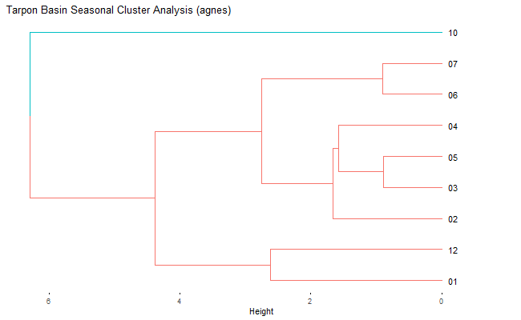
```

```{r 26Fig, fig.cap="Rodriguez Key Seasonal Cluster Analysis Dendrogram: Agglomerative hierarchical clustering using the agnes algorithm, Ward's minimum variance, and silhouette cluster validation.", echo=FALSE}
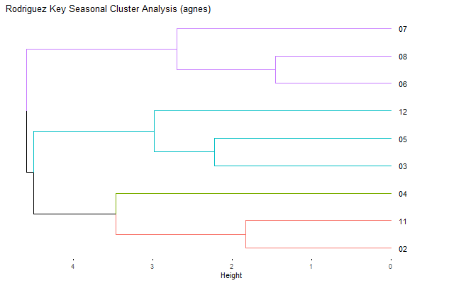
```

```{r 27Fig, fig.cap="Grecian Dry Rocks Seasonal Cluster Analysis Dendrogram: Agglomerative hierarchical clustering using the agnes algorithm, Ward's minimum variance, and silhouette cluster validation.", echo=FALSE}
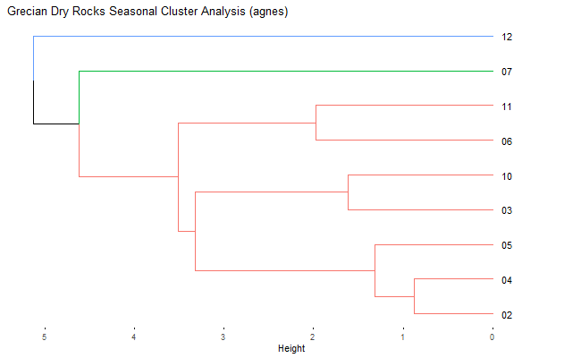
```

## Discussion

## Summary and Interpretation
_Summarize what you did, what you found and what it means._

## Strengths and Limitations
_Discuss what you perceive as strengths and limitations of your analysis._

## Conclusions
_What are the main take-home messages?_

## Supplemental Information
All raw data, processing scripts, analysis scripts, figures, and manuscript products can be found within the GitHub repository for this project at: [https://github.com/epid8060fall2019/William-Norfolk-Project](https://github.com/epid8060fall2019/William-Norfolk-Project).

Supplemental figures and tables can be found within the supplementary materials script located in the project repository.

FKNMS water quality metadata can be accessed at: [http://ocean.floridamarine.org/FKNMS_wqpp/waterQualityNew.htm](http://ocean.floridamarine.org/FKNMS_wqpp/waterQualityNew.htm).

# References

