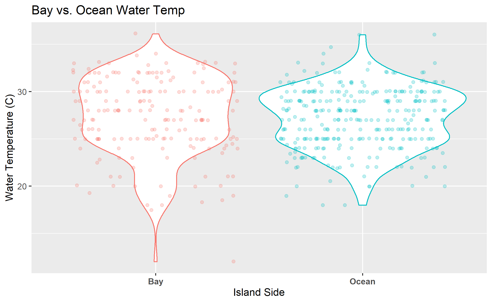
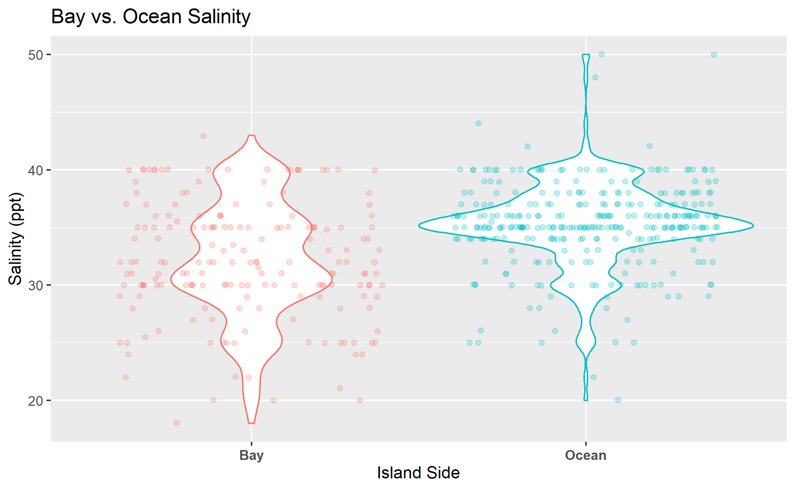
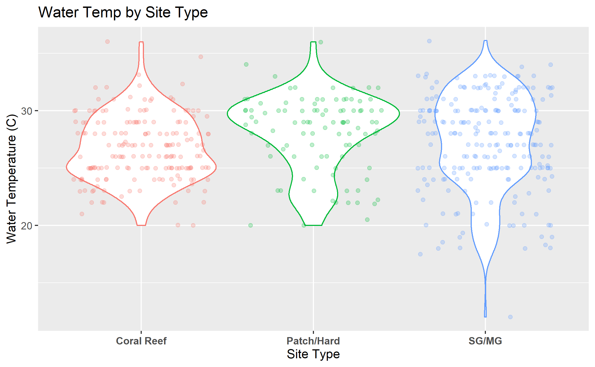

# Summary/Abstract
_Write a summary of your project._


# Introduction 

## General Background Information
Water quality assessment is a core component of experimental design in a wide range of scientific disciplines. Water condition is imperative to environmental and human health, both as a direct concern such as in the case of aquatic organisms or indirectly such as in the case of irrigation of crops[NEW REF]. The utility of water quality data is due to the fact that key parameters can provide information on the baseline health conditon of a water system at a relatively low cost in sampling methodology. The efficacy and cost of water sampling has allowed the techniques to become ubiquitous across the field of environmental science and has become a core component of ecosystem health assessment[@Bertollo2008]. The relative ease of sampling and low cost of materials is particularly useful for research requiring a large number of samples, such as in ecosystem monitoring[@Bertollo2008].

Ecosystem monitoring is the measurement of changes that occur within an ecosystem over time[@Blissetal2001]. Monitoring studies gather data on specific health indicators of interest and use these data to assess long and short-term changes within an ecosystem. Water quality is one of the most common monitoring indicators due to the high level of ecosystem response to changes in water conditions, and the accessibility of methods and equipment. Worldwide programs have been established to gather water quality data though the power of citizen science and outreach. Though a vast amount of data has been collected from various programs, much of the analysis done has been conducted at the state to country scale. Numerous data sets exist at smaller scales which can provide useful information on the local microhabitats of various water systems that may be overlooked when assessed as a larger data set. Here we assess the marine water quality conditions of Key Largo, Florida from 2016 to 2019 through the use of citizen science collected data. 

Key Largo is the northernmost island in the Florida Keys archipelago, and the self-proclaimed "Diving Capital of the World." The waters surrounding Key Largo support three major aquatic habitats: seagrass/mangroves, patch reefs/hardbottom and coral reefs[@Kruczynski2012]. Though distinct in community structure, these three ecosystems exist in delicate balance with one another by means of water-mediating ecosystem functions[@Barnsetal2014]. Key Largo is surrounded on all sides by two major bodies of water: the Florida bay which rests on the Gulf of Mexico side of the island, and the Atlantic Ocean. Florida Bay is a relatively small body of water that extends from the tip of mainland Florida and boarders the west coast of the Upper Florida Keys. The bayside is a relatively shallow enclosed body of water with a dynamic range of abiotic conditions favorable to seagrass and mangrove habitats. The oceanside boasts a substantially deeper and larger body of water with a relatively stable range of abiotic conditions favorable to coral reef and patch reef/hardbottom habitats.

The health of these three major aquatic ecosystems is dependent on the stability of the abiotic conditions of associated waters. Though each of these aquatic habitats are closely associated to the island of Key Largo, chemical and geographical conditions differ between systems and thus support considerably different community structures. Adequate monitoring of these coastal water systems is imperative to the continued environmental and economic health of the island. Citizen science data collection enables researchers to collect information at a substantially larger scale than would be possible alone. The analysis of these data will be used to establish a baseline health condition for various water bodies associated with Key Largo; and will produce data visuals to enrich future citizen science programs. 

## Description of data and data source
These data are water quality measurements collected in Key Largo, Florida by the Marine Resources Development Foundation from 2016 to 2019. The Marine Resources Development Foundation is an environmental education non-profit that provides an immersive marine science field experience for students ranging from fourth grade to undergraduates. Marinelab students take a variety of courses to educate them about the local ecosystems and complement their laboratory and classroom time with daily field trips to the ecosystem of interest. Many courses within the Marinelab curriculum contain integrative data collection programs which task students with the collection of citizen science data on the health of local ecosystems. All data is collected in the field on paper data sheets and is entered into a master raw database by a Marinelab staff members. Specific subsets of citizen science data collected through the programs are passed onto other monitoring agencies for further processing based on individual need and interest.

These data are raw water quality data collected from various sampling sites frequented by Marinelab vessels. Water quality data is characterized by 11 distinct variables: date, time, location, instructor name, group name, pH, ammonia, dissolved oxygen, water temperature, salinity, and equipment. The variables: date, time, location, instructor name, group name, and equipment are all clerical data which provide information on the measuring techniques and site characteristics of a sample. The variables: pH, temperature, dissolved oxygen, salinity, and ammoina are water quality parameters used to assess the abiotic conditions of the sample site. The Marine Resources Development Foundation has a desire to learn the large-scale patterns of the local water quality to better educate students enrolled in the program. Though this data has been collected for some time, no formal analysis of the data has ever been conducted at a large-scale with the master data. 

## Questions/Hypotheses to be addressed

_Question 1: Ocean Verses Bay_

What are the major differences in water quality parameters between Oceanside and Bayside site locations?

_Question 2: Change Over Time_

Have the water quality conditions of sampling sites changed over the three years of observation, and can we see impacts of hurricane Irma on the expected conditions?

_Question 3: Seasonal Change_

Are there notable seasonal changes in the abiotic conditions of the water?

_Question 4: Citizen Science Data Efficacy_

Is citizen science data accurate enough to capture large-scale environmental trends and is the data specific enough to characterize different aquatic habitat types.

_Question 5: Data Clustering_

How are sampling sites grouped in terms of water quality measures? 
Are there any site-wise, annual, and/or seasonal patterns that can be identified from these grouping patterns?

_Objective 6: Promoting Future Citizen Science_

Develop a script for the immediate processing of data collected by groups actively in the Marinelab program. The goal of this objective is to write a ready-to-use script that will produce boxplot plots of the five water quality parameters to compare and contrast island side and site type between locations. These figures will then be used to show students the results of their data collection over the course of their time at Marinelab. The script will be tailored to accept a specifically formatted .xlsx file to ensure the data can be run with minimal to no cleaning required. Detailed instructions for data entry into the .xlsx file, and instructions for loading and running the script can be found in the README.md file in the _code_ folder.

## Methods

### Field Methods
All data was collected by students or instructors of the Marinelab environmental education program. All collectors are required to complete a one-hour training program to familiarize themselves with the testing materials and data recording before they are permitted to work in the field. Data is collected in the field at various sampling locations dictated by the needs of the program, accessibility of location, and weather conditions. On site, a grab sample of water is collected and brought onto the vessel for testing. Abiotic conditions are measured immediately following collection and scored onto a paper record sheet. All measures are taken using semiquantative testing equipment or with a YSI Sonde. Temperature is measured in Celsius using a standard thermometer attached to a string to ensure body heat does not skew the data. Salinity is measured with a standard hydrometer and/or refractometer in ppt. Dissolved Oxygen is measured using a colormetric ampoule analysis in mg/L. Ammonia and pH are both measured using standardized test kits contiaing test strips and reagent solution respectively. All data sheets are collected and entered into the master database upon return to shore. 

### Analysis Methods
All data was processed and analyzed using R Studio software. Individual components of processing or analysis are broken into eight distinct scripts to clean raw data and address the major objectives of the study.

#### Data Acquisition
The raw citizen science data was acquired from the Marinelab citizen science master database. The database is privately maintained by the Marine Resources Development Foundation and is not readily available online. Data is primarily used as a tool to enrich scientific education in the Marinelab program; however data may be distributed for analysis at the discretion of the director of the program. This analysis was conducted under the permission of the current Marinelab director Sarah Egner, and the resulting analysis will be used for the enrichment of future programs. 
The raw Florida Keys National Marine Sanctuary (FKNMS) data was aquired from FKNMS Water Quality Protection Program metadata repository and is freely available online. A link to this metadata repository can be found in the supplemental materials. 

#### Data Import and Cleaning
All raw data was imported as xlsx files and cleaned for optimal analysis in R. Raw citizen science data was organized to improve data interpretability and visualization. New variables were added to this dataset to create comparable categorical subgroups based on the sampling location of the observation. Citizen science processing code can be found in the project repository under the WQprocessing.Rmd file. Raw FKNMS data was subsetted to isolate replicate sampling locations to the citizen science data and cleaned for optimal analysis in R. FKNMS processing is acomplished as a component of the citizen_science_efficacy_analysis.Rmd script located within the project directory. 

#### Promoting Future Citizen Science
To facilitate the efforts of MarineLab and future citizen science interests, a ready-to-use shell processing/analysis script and a complementary raw data shell were designed. This shell and script allow for the rapid visualization of collected data which can be used to educate students who participate in citizen science water quality monitoring. Components and instructions for the usage of this script can be found in the supplemental materials.

#### Exploratory/Univariate Analysis
Exploratory analysis of the citizen science data investigated the general distribution of water quality parameters and was broken into two subgroups, location analysis and seasonal analysis. Exploratory location analysis measured the water quality conditions based on island side and site type of the sampling location. Exploratory seasonal analysis visualized the long-term patterns of water quality conditions across the four years of data collection.

#### Bivariate Analysis
Bivariate analysis measured the correlations between individual water quality parameters and investigated the deeper associations of seasonal trends across multiple variations of data timescales and categories. 

#### Hurricane Irma Analysis
Hurricane Irma analysis investigated the water quality effects of the September 10, 2017 landfall of Hurricane Irma in the Florida Keys. A hurricane-influenced data subset was created and the time series was visualized to show changes in the baseline water quality parameters in response to storm landfall. Hurricane-influenced data was compared to non-influenced data using a Two-sample Kolmogorov-Smirnov test to determine if the hurricane had any significant effects on the water quality following landfall.

#### Citizen Science Efficacy Analysis
Citizen science efficacy analysis compared the water quality measures collected through citizen science monitoring to professionally collected water quality data by the FKNMS. Water quality parameters were compared only using sites which were commonly sampled in both programs and had at least 20 total observations per site.  

#### Unsupervised Learning Analysis
Agglomerative hierarchical cluster analysis was used to determine how individual sampling sites were grouped in terms of the water quality condition. Systematic subsetting of cluster data was used to investigate the patterns of grouping within specific site types, sampling months, and years of measurement.

## Results

### Exploratory/Univariate analysis
Exploratory analysis of the cleaned water quality dataset shows general trends across all parameters measured and identifies specific aspects of the code that warrent deeper analysis. 

The first variables explored will be collectively refrred to as the location variables, as they provide site specific information of the sampling locations that is understandable to inividuals that are not familar with the specific sites by name. Loaction variables explored consisted of island_side and site_type. Island_side refers to the specific side of the island the sampling site is located and consists of two categories: oceanside (Atlantic Ocean) and bayside (Gulf of Mexico). Site_type defines the specific type of ecosystem the site represents and consists of three categories: coral reef, seagrass/mangroves, and path reef/hardbottom. The thee site categories are distinguished by distance from shore, seagrass/mangrove represent near shore sites, path reef/hardbottom are mid-shore, and coral reefs are offshore locations. 

Notable location patterns were observed in both salinity and temperature parameters for both island_side and site_type. Oceanside sites typically showed a reduced range of temperature and salinity measures, whereas bayside sites were distinctly dynamic. In terms of site_type, seagrass/mangrove sites generally exhibited a wider range of temperature and salinity, whereas coral reefs and patch reefs/hardbottom sites were less variable. The following trends can be seen in figures 1-4 below. 

```{r 1Fig, fig.cap="Distribution of water temperature (C) for bayside and oceanside site locations.", echo=FALSE}


```

```{r 2Fig, fig.cap="Distribution of salinity (ppt) for bayside and oceanside site locations.", echo=FALSE}

```

```{r 3Fig, fig.cap="Distribution of water temperature (C) for Coral Reef, Seagrass/Mangrove, and Patch Reef/Hardbottom site types.", echo=FALSE}

```

```{r 4Fig, fig.cap="Distribution of salinity (ppt) for Coral Reef, Seagrass/Mangrove, and Patch Reef/Hardbottom site types.", echo=FALSE}

```

The scond half of the exploratory data analysis was focused on the seasonal data associated with the measured observations. Each water quality parameter was averaged and plotted against the total time of the study to determine seasonal fluctuations and look for abiotic impacts of Hurrican Irma which occurred in September 2017. Ammonia showed a steady average spread with minor seasonal variation and a large spike in the fall of 2017 consistent with Hurricane Irma landfall. pH showed a range of values with no discernable seasonal trends. A drop was indicated in pH following Hirrican Irma, however the decline is consistent with previous fluctuations. Salinity showed a moderate seasonal trend with a sharp decrease following Hurricane Irma. Dissolved oxygen showed steady seasonal fluctuations with a slightly lower dip following Hurricane Irma landfall. Water temperature showed a consistent pattern of seasonal fluctuation across the four years of study. It should be noted that despite the apparent alignment of abiotic changes in relation to Hurricane Irma landfall, substantially fewer data was gathered in the months following the storm compared to other years due to the unsafe conditions of water travel.


```{r 5Fig, fig.cap="Annual fluctuation of water quality parameters in Key Largo, Florida from January 2016 to August 2019.", echo=FALSE}
knitr::include_graphics("../../results/Exploratory_Seasonal_Figures/combined_seasonal_trends.png")
```


### Bivariate Analysis

Bivariate analysis investigated the deeper associations of the five water quality parameters as well as details the specifics of seasonal variation among the parameters. 

Analysis of the associations between each of the five water quality parameters show no discernable associations between variables that are distinct from the results of the above univariate analysis. The various patterns associated with island side and site type can be visualized in the bivariate comparisions of parameters, however no novel correlations were observed. All bivariate analysis figures can be viewed in the supplementary data folder of the project. 

Bivariate analysis permitted the in depth visualization of all five water quality parameters across the annual time scale allowing for a detailed view of seasonal water conditions. 

```{r 6Fig, fig.cap="Seasonal water temperature (C) of ocean and bayside site locations in Key Largo, Florida.", echo=FALSE}
knitr::include_graphics("../../results/Bivariate_Figures/temp_by_year.png")
```

Analysis of water temperature showed distinct seasonal patterns of temperature rise an fall consistent with cooler and warmer months of the year. For all four years of study, bayside site locations showed a greater temperature range when compared to oceanside sites, this finding is consistent with univariate visualizations. 

```{r 7Fig, fig.cap="Seasonal salinity levels (ppt) of ocean and bayside site locations in Key Largo, Florida.", echo=FALSE}
knitr::include_graphics("../../results/Bivariate_Figures/sal_by_year.png")
```

Analysis of salinity showed a distinct seperation of bayside and oceanside waters with salinity typically greater in the ocean and reduced in the bay. Bayside site locations showed a much wider range of salinity conditions whereas the ocean was relatively stenohaline. There is a distinct jump in the salinity of bayside site locations in 2016 and 2019 associated with the months of March and April. 2017 showed a distinctive drop in the salinity of the bay associated with the month of September. 

```{r 8Fig, fig.cap="Seasonal dissolved oxygen levels (mg/L) of ocean and bayside site locations in Key Largo, Florida.", echo=FALSE}
knitr::include_graphics("../../results/Bivariate_Figures/do_by_year.png")
```

Analysis of dissolved oxygen did not reveal any distinct seasonal patterns in the oxygen levels of Key Largo waters. Bayside sites typically showed a lower minimum dissolved oxygen level, whereas the max was variable between the two island sides. 

```{r 9Fig, fig.cap="Seasonal ammonia levels (mg/L) of ocean and bayside site locations in Key Largo, Florida.", echo=FALSE}
knitr::include_graphics("../../results/Bivariate_Figures/amm_by_year.png")
```

Ammonia analysis did not show any consistent seasonal fluctuation patterns across all years of measure. Levels on both the bayside and oceanside remain relatively low through the course of study, however there is a large spike in 2017 near the month of September. 

```{r 10Fig, fig.cap="Seasonal pH levels of ocean and bayside site locations in Key Largo, Florida.", echo=FALSE}
knitr::include_graphics("../../results/Bivariate_Figures/ph_by_year.png")
```

Analysis of pH levels showed no discernable seasonal fluctuations. pH remained relatively constant at both bayside and oceanside site locations. The minimum and maximum pH levels did not show any distinct patterns between island sides. 

### Hurricane Irma Analysis

Hurricane Irma analysis investigated the specific impacts of hurricane Irma landfall on the five water quality parameters measured in this study. Hurricane Irma made landfall on September 10, 2017. Figures in this analysis represent continious time data from the start of 2017 to the end of 2018 to allow visualization of the acute and subacute effects of hurricane landfall.

```{r 11Fig, fig.cap="Influence of Hurricane Irma landfall on the mean water temperatures (C) of ocean and bayside waters of Key Largo, Florida. Hurricane Irma landfall occured on September 10, 2017 (indicated by dashed line).", echo=FALSE}

```

Water temperature associated with Irma landfall showed a notable drop in the months following the storm. This drop was largest for bayside site locations. IT should be noted this decrease is consistent with the timing of standard seasonal fluctuation of water temperature in the Florida Keys.

```{r 12Fig, fig.cap="Influence of Hurricane Irma landfall on the mean salinity levels (ppt) of ocean and bayside waters in Key Largo, Florida. Hurricane Irma landfall occured on September 10, 2017 (indicated by dashed line).", echo=FALSE}
knitr::include_graphics("../../results/Hurricane_Irma_Figures/imra_mean_sal_plot.png")
```

Salinity levels associated with hurricane landfall showed a distinctive decrease for bayside site locations. The mean salinity of the ocean however remained relatively constant following the storm.

```{r 13Fig, fig.cap="Influence of Hurricane Irma landfall on the mean dissolved oxygen levels (mg/L) of ocean and bayside waters in Key Largo, Florida. Hurricane Irma landfall occured on September 10, 2017 (indicated by dashed line).", echo=FALSE}
knitr::include_graphics("../../results/Hurricane_Irma_Figures/imra_mean_do_plot.png")
```

Dissolved oygen associated with hurricane landfall did not show any notable changes for both bayside and oceanside site locatons. There is a distinct decrease in the mean dissolved oxygen for the bay observed in the latter months of 2018. 


```{r 14Fig, fig.cap="Influence of Hurricane Irma landfall on the mean ammonia levels (mg/L) of ocean and bayside waters in Key Largo, Florida. Hurricane Irma landfall occured on September 10, 2017 (indicated by dashed line).", echo=FALSE}
knitr::include_graphics("../../results/Hurricane_Irma_Figures/imra_mean_amm_plot.png")
```

Ammonia levels associated wit Hurricane Irma showed a dramatic spike in bayside site locations immediately following landfalland a small increase for oceanside sites. There is an additional drop and upspike in bayside ammonia associated with the spring-summer of 2018. 

```{r 15Fig, fig.cap="Influence of Hurricane Irma landfall on the mean pH levels of ocean and bayside waters in Key Largo, Florida. Hurricane Irma landfall occured on September 10, 2017 (indicated by dashed line).", echo=FALSE}

```

pH levels associated with hurricane landfall showed a moderate drop for bayside site locations and little chnge for oceanside waters. The decrease in bayside pH is associated with and acute timeline of hurricane landfall, however the drop is not as substantial as some of the previously recorded fluctuations of pH from the seasonal analysis.


Water quality parameters of September-Febuary from Irma landfall were compared using a Two-sample Kolmogorov-Smirnov test to water quality measures from the year prior to determine if any of the five parameters were statistically significant. The results of the Kolmogorov-Smirnov test showed a p-value of 0.227 for water temperature, 0.002 for salinity, 0.499 for dissolved oxygen, 0.002 for ammonia, and 0.334 for pH. These results suggest that the salinity and ammonia levels were siginifcantly influenced by the landfall of Hurricane Irma. This significance is consistent with the visuals of univariate, bivariate, and Hurricane Irma analysis. 

### Unsupervised Learning Analysis

## Discussion

## Summary and Interpretation
_Summarize what you did, what you found and what it means._

## Strengths and Limitations
_Discuss what you perceive as strengths and limitations of your analysis._

## Conclusions
_What are the main take-home messages?_

## Supplemental Information
All raw data, processing scripts, analysis scripts, figures, and manuscript products can be found within the GitHub repository for this project at: [https://github.com/epid8060fall2019/William-Norfolk-Project](https://github.com/epid8060fall2019/William-Norfolk-Project).

Supplemental figures and tables can be found within the supplementary materials script located in the project repository.

FKNMS water quality metadata can be accessed at: [http://ocean.floridamarine.org/FKNMS_wqpp/waterQualityNew.htm](http://ocean.floridamarine.org/FKNMS_wqpp/waterQualityNew.htm).

# References

