# Abstract
Water quality assessment is an integral component of ecosystem monitoring and resource management Long-term water quality data collection requires the usage of highly expensive monitoring machinery and/or substantial manpower to visit sites of interest frequently to collect data. Citizen science monitoring programs aim to alleviate this limitation through the usage of large-scale manpower crowdsourcing efforts to reduce the need for frequent site visitation by researchers. In this study, we analyze the citizen science water quality monitoring data collected through the MarineLab environmental education program from 2016-2019. Water quality measures for: water temperature, salinity, dissolved oxygen, ammonia, and pH were recorded from field sampling trips and uploaded into a master raw databse for analyses. Comparative analyses were used to assess the general trends of water quality parameters based on location, season, and Hurricane Irma impacts. Efficacy analysis compared the results of citizen science data to data collected by the Florida Keys National Marine Sanctuary (FKNMS). Unsupervised hierarchical cluster analysis was used to visualize general grouping patterns of the data by sampling location and month of collection. The results of this study suggest that citizen science data is an effective metric for the characterization of large-scale water quality trends. Sites characterized as bayside and/or seagrass/mangrove typically showed a greater range of water temperature and salinity conditions compared to a narrow ranges seen in oceanside, coral reefs, and/or patch reefs/hardbottom sites. Water temperature showed a strong seasonal correlation whereas all other parameters showed no distinct pattern of fluctuation across the time series. FKNMS comparison analysis showed consistent general trends in the data for all replicate sampling sites with apparent limitations in citizen science collection likely due differences in equipment specificity. Water quality cluster analysis suggests that seagrass/mangrove and patch reefs/hardbottom sites are relatively distinct within in their specific subgroups compared to coral reefs which are less variable. Seasonal clustering suggests that seasgrass/mangrove sites are strongly influenced by seasonal abiotic condition fluctuation whereas, coral reefs and patch reefs/hardbottom sites show little seasonal grouping. The results of these analyses present a characterization of small-scale water quality parameters in the highly vulnerable aquatic ecosystems of Key Largo and show the utility of citizen science monitoring as a tool for mass data collection. 

# Introduction 

## General Background Information
Water quality assessment is a core component of experimental design in a wide range of scientific disciplines. Water condition is imperative to environmental and human health, both as a direct concern such as in the case of aquatic organisms or indirectly such as in the case of irrigation of crops[@Hewittetal2005;@Borjaetal2012]. The utility of water quality data is due to the fact that key parameters can provide information on the baseline health condition of a water system at a relatively low cost in sampling methodology[@Karydis2013]. The efficacy and cost of water sampling has allowed the techniques to become ubiquitous across the field of environmental science and has become a core component of ecosystem health assessment[@Bertollo2008]. The relative ease of sampling and low cost of materials is particularly useful for research requiring a large number of samples, such as in ecosystem monitoring[@Bertollo2008].

Ecosystem monitoring is the measurement of changes that occur within an ecosystem over time[@Blissetal2001]. Monitoring studies gather data on specific health indicators of interest and use these data to assess long and short-term changes within an ecosystem [@Wolfe1987]. Water quality is one of the most common monitoring indicators due to the high level of ecosystem response to changes in water conditions, and the accessibility of methods and equipment[@Karydis2013]. Worldwide programs have been established to gather water quality data though the power of citizen science and outreach[@Buytaertetal2016;@Jollymore2017]. Though a vast amount of data has been collected from various programs, much of the analysis done has been conducted at the state to country scale. Numerous data sets exist at smaller scales which can provide useful information on the local microhabitats of various water systems that may be overlooked when assessed as a larger data set. Here we assess the marine water quality conditions of Key Largo, Florida from 2016 to 2019 through the use of citizen science collected data. 

Key Largo is the northernmost island in the Florida Keys archipelago, and the self-proclaimed "Diving Capital of the World [@Kruczynski2012]." The waters surrounding Key Largo support three major aquatic habitats: seagrass/mangroves, patch reefs/hardbottom and coral reefs[@Miller2000;@Precht2007;@Kruczynski2012;@Vaslet2012]. Though distinct in community structure, these three ecosystems exist in delicate balance with one another by means of water-mediating ecosystem functions[@Kruczynski2012;@Barnsetal2014]. Key Largo is surrounded on all sides by two major bodies of water: the Florida bay which rests on the Gulf of Mexico side of the island, and the Atlantic Ocean[@Precht2007;@Kruczynski2012]. Florida Bay is a relatively small body of water that extends from the tip of mainland Florida and boarders the west coast of the Upper Florida Keys[@Kruczynski2012;@Vaslet2012]. The bayside is a relatively shallow enclosed body of water with a dynamic range of abiotic conditions favorable to seagrass and mangrove habitats[@Kruczynski2012;@Vaslet2012]. The oceanside boasts a substantially deeper and larger body of water with a relatively stable range of abiotic conditions favorable to coral reef and patch reef/hardbottom habitats[@Miller2000;@Precht2007;@Kruczynski2012].

The health of these three major aquatic ecosystems is dependent on the stability of the abiotic conditions of associated waters[@Kruczynski2012]. Though each of these aquatic habitats are closely associated to the island of Key Largo, chemical and geographical conditions differ between systems and thus support considerably different community structures[@Kruczynski2012]. Adequate monitoring of these coastal water systems is imperative to the continued environmental and economic health of the island. Citizen science data collection enables researchers to collect information at a substantially larger scale than would be possible alone[@Buytaertetal2016;@Jollymore2017. The analysis of these data will be used to establish a baseline health condition for various water bodies associated with Key Largo; and will produce data visuals to enrich future citizen science programs. 

## Description of data and data source
These data are water quality measurements collected in Key Largo, Florida by the Marine Resources Development Foundation from 2016 to 2019. The Marine Resources Development Foundation is an environmental education non-profit that provides an immersive marine science field experience for students ranging from fourth grade to undergraduates. Marinelab students take a variety of courses to educate them about the local ecosystems and complement their laboratory and classroom time with daily field trips to the ecosystem of interest. Many courses within the Marinelab curriculum contain integrative data collection programs which task students with the collection of citizen science data on the health of local ecosystems. All data is collected in the field on paper data sheets and is entered into a master raw database by a Marinelab staff members. Specific subsets of citizen science data collected through the programs are passed onto other monitoring agencies for further processing based on individual need and interest.

These data are raw water quality data collected from various sampling sites frequented by Marinelab vessels. Water quality data is characterized by 11 distinct variables: date, time, location, instructor name, group name, pH, ammonia, dissolved oxygen, water temperature, salinity, and equipment. The variables: date, time, location, instructor name, group name, and equipment are all clerical data which provide information on the measuring techniques and site characteristics of a sample. The variables: pH, temperature, dissolved oxygen, salinity, and ammoina are water quality parameters used to assess the abiotic conditions of the sample site. The Marine Resources Development Foundation has a desire to learn the large-scale patterns of the local water quality to better educate students enrolled in the program. Though this data has been collected for some time, no formal analysis of the data has ever been conducted at a large-scale with the master data. 

## Questions/Hypotheses to be addressed

_Question 1: Ocean Verses Bay_

What are the major differences in water quality parameters between Oceanside and Bayside site locations?

_Question 2: Change Over Time_

Have the water quality conditions of sampling sites changed over the three years of observation, and can we see impacts of hurricane Irma on the expected conditions?

_Question 3: Seasonal Change_

Are there notable seasonal changes in the abiotic conditions of the water?

_Question 4: Citizen Science Data Efficacy_

Is citizen science data accurate enough to capture large-scale environmental trends and is the data specific enough to characterize different aquatic habitat types.

_Question 5: Data Clustering_

How are sampling sites grouped in terms of water quality measures? 
Are there any site-wise, annual, and/or seasonal patterns that can be identified from these grouping patterns?

_Objective 6: Promoting Future Citizen Science_

Develop a script for the immediate processing of data collected by groups actively in the Marinelab program. The goal of this objective is to write a ready-to-use script that will produce boxplot plots of the five water quality parameters to compare and contrast island side and site type between locations. These figures will then be used to show students the results of their data collection over the course of their time at Marinelab. The script will be tailored to accept a specifically formatted .xlsx file to ensure the data can be run with minimal to no cleaning required. Detailed instructions for data entry into the .xlsx file, and instructions for loading and running the script can be found in the README.md file in the _code_ folder.

# Methods

## Field Methods
All data was collected by students or instructors of the Marinelab environmental education program. All collectors are required to complete a one-hour training program to familiarize themselves with the testing materials and data recording before they are permitted to work in the field. Data is collected in the field at various sampling locations dictated by the needs of the program, accessibility of location, and weather conditions. On site, a grab sample of water is collected and brought onto the vessel for testing. Abiotic conditions are measured immediately following collection and scored onto a paper record sheet. All measures are taken using semiquantative testing equipment or with a YSI Sonde. Temperature is measured in Celsius using a standard thermometer attached to a string to ensure body heat does not skew the data. Salinity is measured with a standard hydrometer and/or refractometer in ppt. Dissolved Oxygen is measured using a colormetric ampoule analysis in mg/L. Ammonia (mg/L) and pH are both measured using standardized test kits containing test strips and reagent solution respectively. All data sheets are collected and entered into the master database upon return to shore. 

## Analysis Methods
All data was processed and analyzed using R Studio software. Individual components of processing or analysis are broken into eight distinct scripts to clean raw data and address the major objectives of the study.

#### Data Acquisition
The raw citizen science data was acquired from the Marinelab citizen science master database. The database is privately maintained by the Marine Resources Development Foundation and is not readily available online. Data is primarily used as a tool to enrich scientific education in the Marinelab program; however, data may be distributed for analysis at the discretion of the director of the program. This analysis was conducted under the permission of the current Marinelab director Sarah Egner, and the results will be used for the enrichment of future outreach programs. 
The raw Florida Keys National Marine Sanctuary (FKNMS) data was acquired from FKNMS Water Quality Protection Program metadata repository and is freely available online. A link to this metadata repository can be found in the supplemental materials. 

#### Data Import and Cleaning
All raw data was imported as xlsx files and cleaned for optimal analysis in R. Raw citizen science data was organized to improve data interpretability and visualization. New variables were added to this dataset to create comparable categorical subgroups based on the sampling location of the observation. Citizen science processing code can be found in the project repository under the WQprocessing.Rmd file. Raw FKNMS data was subsetted to isolate replicate sampling locations to the citizen science data and cleaned for optimal analysis in R. FKNMS processing is accomplished  as a component of the citizen_science_efficacy_analysis.Rmd script located within the project directory. 

#### Promoting Future Citizen Science
To facilitate the efforts of MarineLab and future citizen science interests, a ready-to-use processing/analysis script and a complementary raw data shell were designed. This shell and script allow for the rapid visualization of collected data which can be used to educate students who participate in citizen science water quality monitoring. Components and instructions for the usage of this script can be found in the supplemental materials.

#### Exploratory/Univariate Analysis
Exploratory analysis of the citizen science data investigated the general distribution of water quality parameters and was broken into two subgroups, location analysis and seasonal analysis. Exploratory location analysis measured the water quality conditions based on island side and site type of the sampling location. Island side was broken into two distinct categories: oceanside (Atlantic) and bayside (Gulf of Mexico). Site type was split into three categories: Seagrass/Mangrove, Patch Reef/Hardbottom, and Coral Reef. Island side was determined based on the geographic location of the site in relation to the island of Key Largo and site type was determined by the dominant benthic species of the location. Exploratory seasonal analysis visualized the long-term patterns of water quality conditions across the four years of data collection. Each water quality parameter was averaged and plotted against the total time of the study to determine seasonal fluctuations. It should be noted that due to accessibility constraints/facility closures the months of August and December have a reduced total number of observations compared to the remaining months. This data was compiled in August of 2019 and thus the fall season of this year is excluded from this study. 

#### Bivariate Analysis
Bivariate analysis measured the correlations between the individual water quality parameters themselves and investigated the deeper associations of seasonal trends. Comparative analysis was used to determine correlations between pairs of water quality parameters. Seasonal data series were created for each year of study and compared across a monthly timescale to visualize specific seasonal changes.

#### Hurricane Irma Analysis
Hurricane Irma analysis investigated the water quality effects of the September 10, 2017 landfall of Hurricane Irma in the Florida Keys. A hurricane-influenced data subset was created, and the time series data was visualized to show changes in the baseline water quality parameters in response to storm landfall. Hurricane-influenced data was compared to non-influenced data using a Two-sample Kolmogorov-Smirnov test to determine if the storm had any significant effects on the water quality following landfall.

#### Citizen Science Efficacy Analysis
Citizen science efficacy analysis compared the water quality measures collected through citizen science monitoring to professionally collected water quality data by the FKNMS. Water quality parameters were compared using common sampling sites with at least 20 recorded observations from both datasets. Site comparison was done using: Tarpon Basin, Grecian Dry Rocks, Key Largo Dry Rocks, Molasses, and Rodriguez Key. Grecian Dry Rocks, Molasses, and Key Largo Dry Rocks all represented coral reef sites. Tarpon Basin represented a seagrass/mangrove habitat site and Rodriguez Key represented a patch reef/hardbottom site. Comparative analysis of pH measures were unable to be conducted due to insufficient pH data in the FKNMS database. 

#### Unsupervised Learning Analysis
Agglomerative hierarchical cluster analysis was used to determine how individual sampling sites were grouped in terms of the water quality condition. Systematic subsetting of cluster data was used to investigate the patterns of grouping within specific site types, sampling months, and years of measurement. Dendrograms of cluster analysis were constructed using Ward's minimum variance method and ideal cluster values were assessed using the silhouette and within-cluster sum of squares metrics. Tanglegrams were used to compare dendrograms and entanglement was computed as a metric of similarity. Cluster analysis was broken into three groups: total cluster analysis, site type cluster analysis, and representative site seasonal cluster analysis. Total cluster analysis grouped all of the sampling sites from all years of study. Site type cluster analysis explored the similarity and dissimilarity of sampling locations within each of the three major site types. Representative site seasonal cluster analysis compared the month-wise grouping three most frequently visited sites: Tarpon Basin, Grecian Dry Rocks, and Rodriguez Key (one of each type).

# Results

### Exploratory/Univariate analysis
Exploratory analysis showed the general trends of water quality conditions within categorical location groups and across the timeseries of the study. Location analysis showed abiotic water quality conditions of sampling sites based on island side and site type. Water temperature showed a consistent average for both ocean and bayside site locations near 29 degrees with a wider range of temperature in the bayside. When compared by site type, both coral reefs and patch reef/hardbottom sites exhibit stenothermal temperature distributions whereas seagrass/mangrove habitats are more eurythermal. The greatest temperature average was seen in path reefs/hardbottom sites. Temperature results can be viewed in Figure 1. Salinity showed a similar location-based distribution with a wider salinity range seen in bayside sites and a greater average salinity (35ppt) on the oceanside. Coral reefs and patch reefs/hardbottom sites showed a similar stenohaline distribution whereas seagrass/mangrove locations were more euryhaline. The results of salinity can be viewed in Figure 2. Dissolved oxygen measures did not show any notable patterns of location-based changes beyond small differences in outlier measures for both island side and site type comparisons. The results of dissolved oxygen can be viewed in Figure 3 below. Ammonia measures were infrequently above zero and show no discernable pattern based on island side. Site type comparison shows a slight increase in the ammonia for seagrass/mangrove sites. Ammonia results can be viewed in Figure 4. pH measures did not show any discernable patterns of location-based changes in concentration across island side and site type. pH results can be viewed in Figure 5. 

```{r 1Fig, fig.cap="Water temperature (C) distribution comparison of island side and site type sampling locations in Key Largo, Florida.", echo=FALSE}
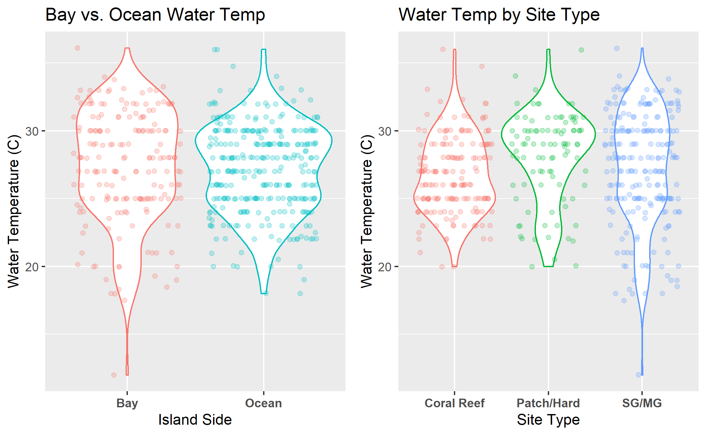

```

```{r 2Fig, fig.cap="Salinity (ppt) distribution comparison of island side and site type sampling locations in Key Largo, Florida.", echo=FALSE}
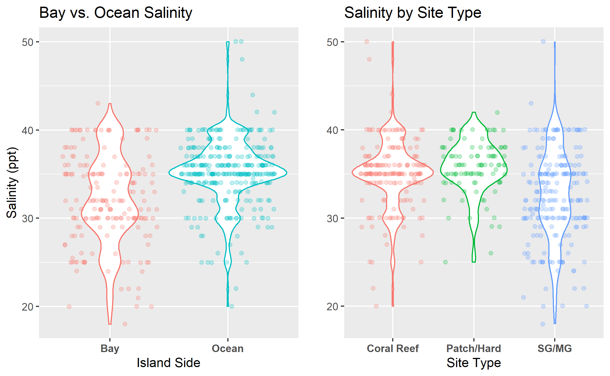
```

```{r 3Fig, fig.cap="Dissolved oxygen (mg/L) distribution comparison of island side and site type sampling locations in Key Largo, Florida.", echo=FALSE}
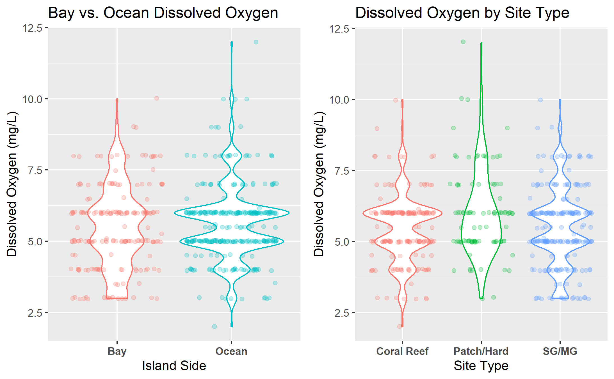

```

```{r 4Fig, fig.cap="Ammonia (mg/L) distribution comparison of island side and site type sampling locations in Key Largo, Florida.", echo=FALSE}


```

```{r 5Fig, fig.cap="pH distribution comparison of island side and site type sampling locations in Key Largo, Florida.", echo=FALSE}
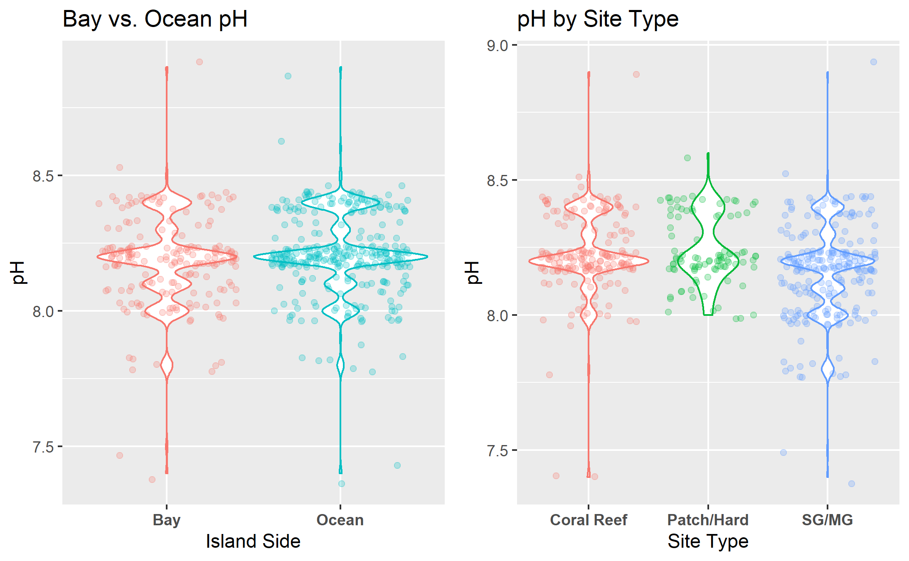

```


Seasonal analysis visualized the general timescale trends in all water quality parameters averaged across the four years of study. This analysis revealed a fluctuation in the mean water temperature consistent with the occurrence of the seasons. Dissolved oxygen measures showed a similar overall pattern of fluctuation however, the timing of this pattern was inconsistent with the seasonal cycle. All remining water quality parameters showed inconsistent patterns of increase and decrease which will be discussed in further analyses. Annual fluctuation results can be viewed in Figure 6.

```{r 6Fig, fig.cap="Annual fluctuation of water quality parameters in Key Largo, Florida from January 2016 to August 2019.", echo=FALSE}
knitr::include_graphics("../../results/Exploratory_Seasonal_Figures/combined_seasonal_trends.png")
```


### Bivariate Analysis

Comparative analysis of the associations between each of the five water quality parameters show no discernable associations between variables that are distinct from the results of the above univariate analyses. The various patterns associated with island side and site type can be visualized in the bivariate comparisons of these parameters, however no novel correlations were observed. All comparative analysis figures can be viewed in the supplementary data folder of the project. 

Bivariate analysis permitted the in-depth visualization of all five water quality parameters across the annual time scale allowing for a detailed view of the seasonal water conditions for bay and oceanside sites. Analysis of water temperature showed distinct seasonal patterns of temperature rise and fall consistent with cooler and warmer months of the year. For all four years of study, bayside site locations showed a greater temperature range when compared to oceanside sites, consistent with the findings of univariate analyses. Bivariate water temperature analysis can be viewed in Figure 7. Salinity showed a distinctive separation of bayside and oceanside waters with measures typically greater in the ocean (35ppt average) and reduced in the bay (32ppt average). Bayside site locations showed a much wider range of salinity conditions whereas the ocean was relatively stenohaline. There is a distinct jump in the salinity of bayside site locations in 2016 and 2019 associated with the months of March and April. 2017 showed a distinctive drop in the salinity of the bay associated with the month of September. Bivariate salinity results can be viewed in Figure 8.


```{r 7Fig, fig.cap="Seasonal water temperature (C) of ocean and bayside site locations in Key Largo, Florida.", echo=FALSE}
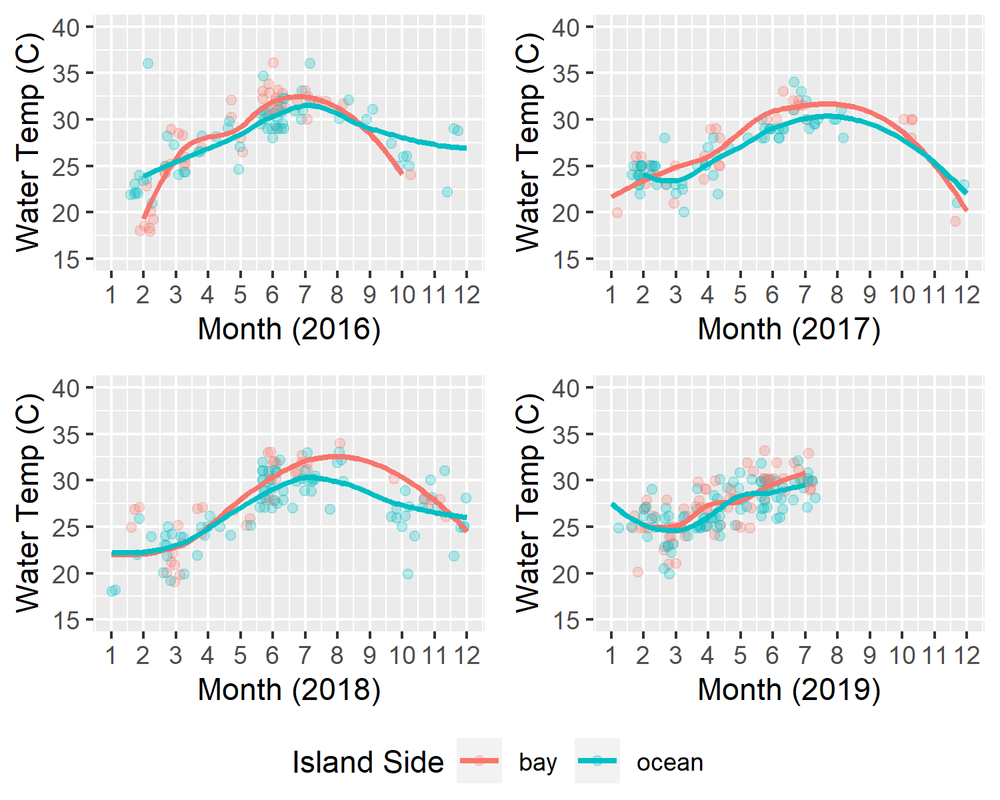
```


```{r 8Fig, fig.cap="Seasonal salinity levels (ppt) of ocean and bayside site locations in Key Largo, Florida.", echo=FALSE}
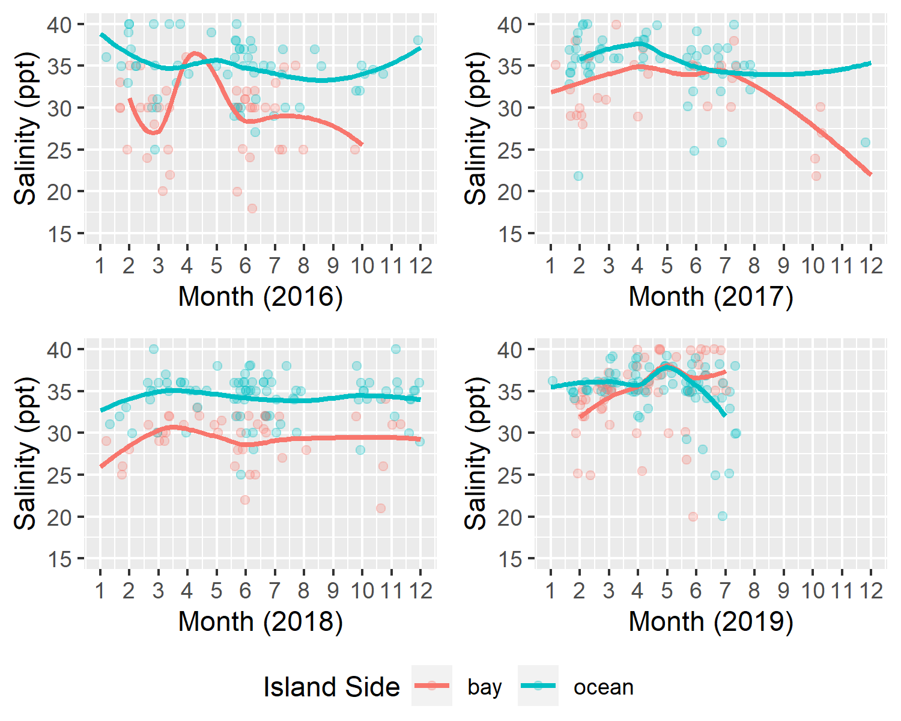
```
 
Analysis of dissolved oxygen did not show any distinct seasonal patterns of fluctuation in Key Largo waters. Bayside sites typically showed a lower minimum dissolved oxygen level, whereas the max was variable between the two island sides. The results of bivariate dissolved oxygen analysis can be viewed in Figure 9. Ammonia analysis did not show any consistent seasonal fluctuation patterns across all years of measure. Levels on both the bayside and oceanside remain relatively low through the course of study with small intermittent spikes occurring occasionally. There is a substantial spike in the bay and oceanside ammonia levels in 2017 coinciding with the late summer to early fall. The results of bivariate ammonia analysis can be viewed in Figure 10. Analysis of pH levels showed no discernable seasonal fluctuations. pH remained relatively constant at both bayside and oceanside site locations. The minimum and maximum pH levels did not show any distinct patterns between the island sides. The results of bivariate pH analysis can be viewed in Figure 11.


```{r 9Fig, fig.cap="Seasonal dissolved oxygen levels (mg/L) of ocean and bayside site locations in Key Largo, Florida.", echo=FALSE}
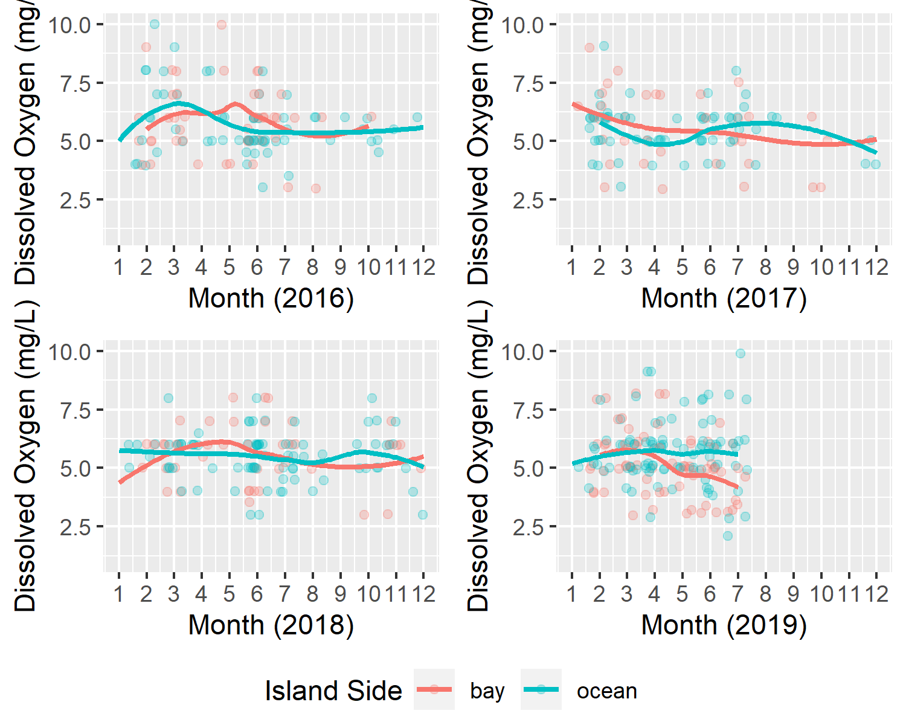
```


```{r 10Fig, fig.cap="Seasonal ammonia levels (mg/L) of ocean and bayside site locations in Key Largo, Florida.", echo=FALSE}
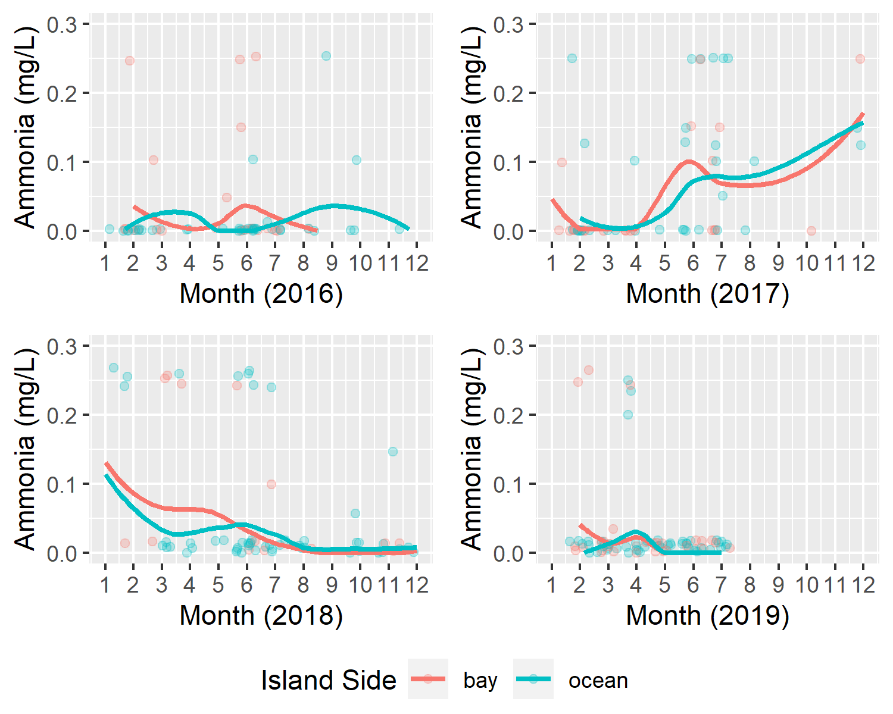
```


```{r 11Fig, fig.cap="Seasonal pH levels of ocean and bayside site locations in Key Largo, Florida.", echo=FALSE}
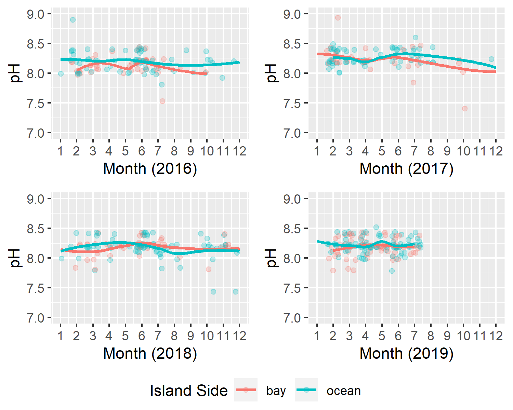
```

### Hurricane Irma Analysis

Hurricane Irma analysis investigated the specific impacts of Hurricane Irma landfall on the five water quality parameters measured in this study. Figures in this analysis represent continuous time data from the start of 2017 to the end of 2018 to allow visualization of the acute and subacute effects of hurricane landfall. 

Water temperature associated with Irma landfall showed a notable decline three months following the storm. This drop was greatest in bayside site locations. It should be noted this decrease is consistent with the timing and patterns of standard seasonal fluctuation of water temperature in the Florida Keys observed through bivariate analyses. The results of Hurricane Irma water temperature effects can be viewed in Figure 12. Salinity levels associated with hurricane landfall showed a sharp decrease for bayside site locations immediately following the storm which persisted for 1-2 months before stabilizing back to a standard level. The mean salinity of the ocean remained relatively constant following the storm. The results of Hurricane Irma salinity effects can be viewed in Figure 13.

```{r 12Fig, fig.cap="Influence of Hurricane Irma landfall on the mean water temperatures (C) of ocean and bayside waters of Key Largo, Florida. Hurricane Irma landfall occured on September 10, 2017 (indicated by dashed line).", echo=FALSE}
knitr::include_graphics("../../results/Hurricane_Irma_Figures/imra_mean_temp_plot.png")
```


```{r 13Fig, fig.cap="Influence of Hurricane Irma landfall on the mean salinity levels (ppt) of ocean and bayside waters in Key Largo, Florida. Hurricane Irma landfall occured on September 10, 2017 (indicated by dashed line).", echo=FALSE}
knitr::include_graphics("../../results/Hurricane_Irma_Figures/imra_mean_sal_plot.png")
```

Dissolved oxygen levels associated with hurricane landfall did not show any notable changes for both bayside and oceanside site locations. There is a distinct decrease in the mean dissolved oxygen for the bay observed in the latter months of 2018. The results of Hurricane Irma dissolved oxygen effects can be viewed in Figure 14. Ammonia levels associated with Hurricane Irma showed a dramatic spike in bayside site locations immediately following landfall and a slight increase for oceanside sites. The large spike in bayside ammonia appears to return to baseline levels by the spring of 2018 however, this return is immediately followed by a second spike in subsequent months. The results of Hurricane Irma ammonia effects can be viewed in Figure 15. pH levels associated with hurricane landfall showed a moderate drop in bayside site levels immediately following the storm. This decrease is consistent with the acute timeline of hurricane landfall however, the drop is not substantially different from standard fluctuations of the bayside pH observed in the bivariate analyses. The results of Hurricane Irma pH effects can be viewed in Figure 16.


```{r 14Fig, fig.cap="Influence of Hurricane Irma landfall on the mean dissolved oxygen levels (mg/L) of ocean and bayside waters in Key Largo, Florida. Hurricane Irma landfall occured on September 10, 2017 (indicated by dashed line).", echo=FALSE}
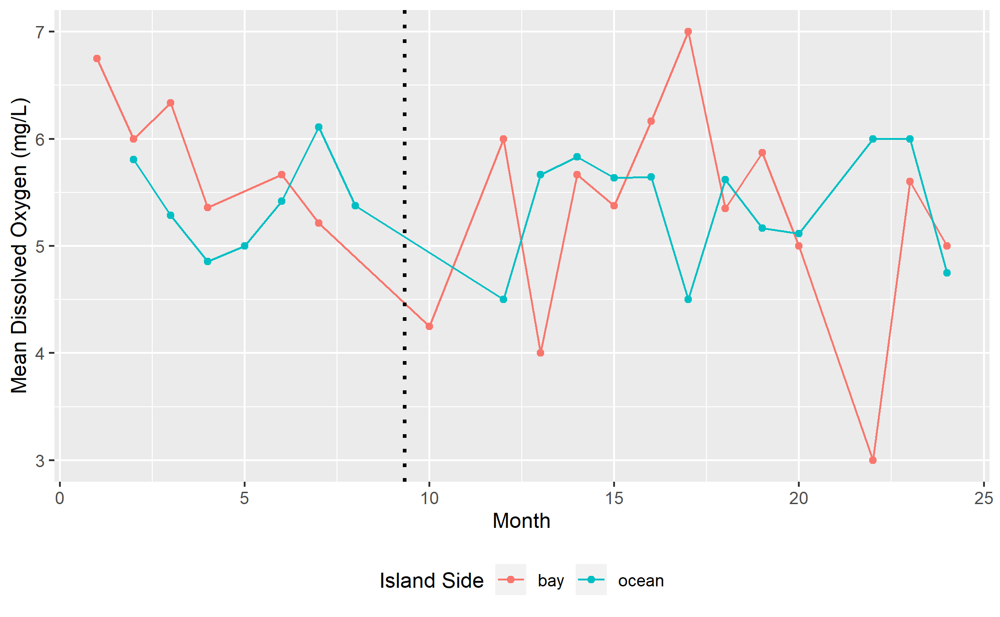
```


```{r 15Fig, fig.cap="Influence of Hurricane Irma landfall on the mean ammonia levels (mg/L) of ocean and bayside waters in Key Largo, Florida. Hurricane Irma landfall occured on September 10, 2017 (indicated by dashed line).", echo=FALSE}
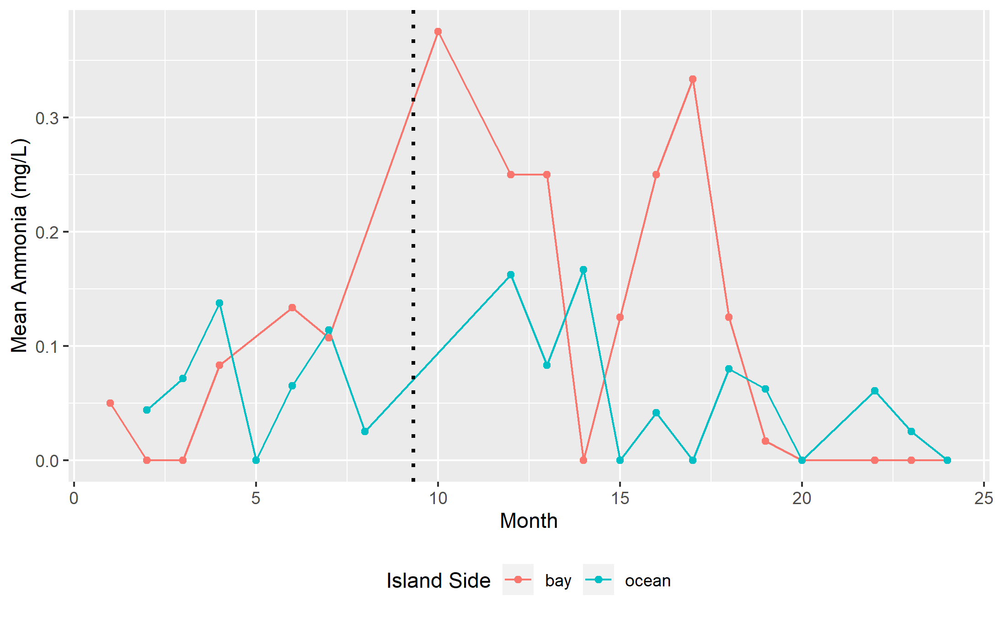
```


```{r 16Fig, fig.cap="Influence of Hurricane Irma landfall on the mean pH levels of ocean and bayside waters in Key Largo, Florida. Hurricane Irma landfall occured on September 10, 2017 (indicated by dashed line).", echo=FALSE}
knitr::include_graphics("../../results/Hurricane_Irma_Figures/imra_mean_ph_plot.png")
```


Water quality parameters from September-February from 2017-2018 were compared to measures from 2016-2017 using a Two-sample Kolmogorov-Smirnov test to determine if any of the five parameters were statistically significant. The results of the Kolmogorov-Smirnov test showed a p-value of 0.227 for water temperature, 0.002 for salinity, 0.499 for dissolved oxygen, 0.002 for ammonia, and 0.334 for pH. These results suggest that the salinity and ammonia levels were significantly influenced by the landfall of Hurricane Irma. This significance is consistent with the visuals produced from univariate, bivariate, and Hurricane Irma analyses. 

### Citizen Science Efficacy Analysis
Citizen science efficacy analysis compared the MarineLab citizen science water quality data to measures collected through the FKNMS water quality monitoring program. Comparison of water temperature measures showed similar patterns of temperature range for all sites. Minor fluctuations in the interquartile range and median values are seen across the comparison however, no distinct pattern of variation is discernable. Comparative water temperature results can be viewed in Figure 17. Comparative salinity analysis showed a distinctive decrease in the size of the interquartile range of salinity measures for FKNMS observations compared to citizen science observations. Both FKNMS and citizen science show Tarpon Basin to have the largest range of salinity which is consistent with the findings of the bivariate analyses. The results of comparative salinity analysis can be viewed in Figure 18.

```{r 17Fig, fig.cap="Comparative analysis of water temperature (C) measures collected from citizen science data verses FKNMS data.", echo=FALSE}
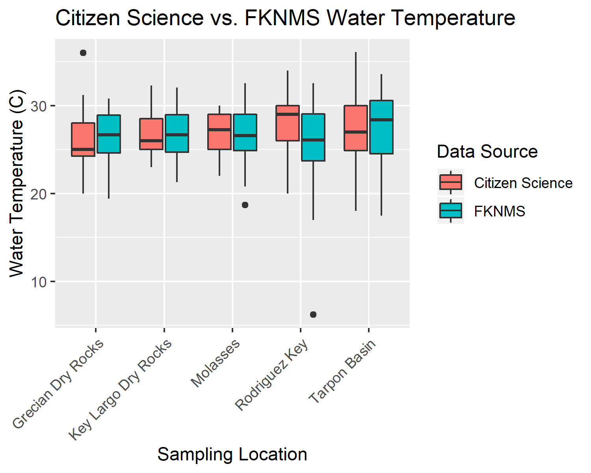
```

```{r 18Fig, fig.cap="Comparative analysis of salinity (ppt) measures collected from citizen science data verses FKNMS data.", echo=FALSE}
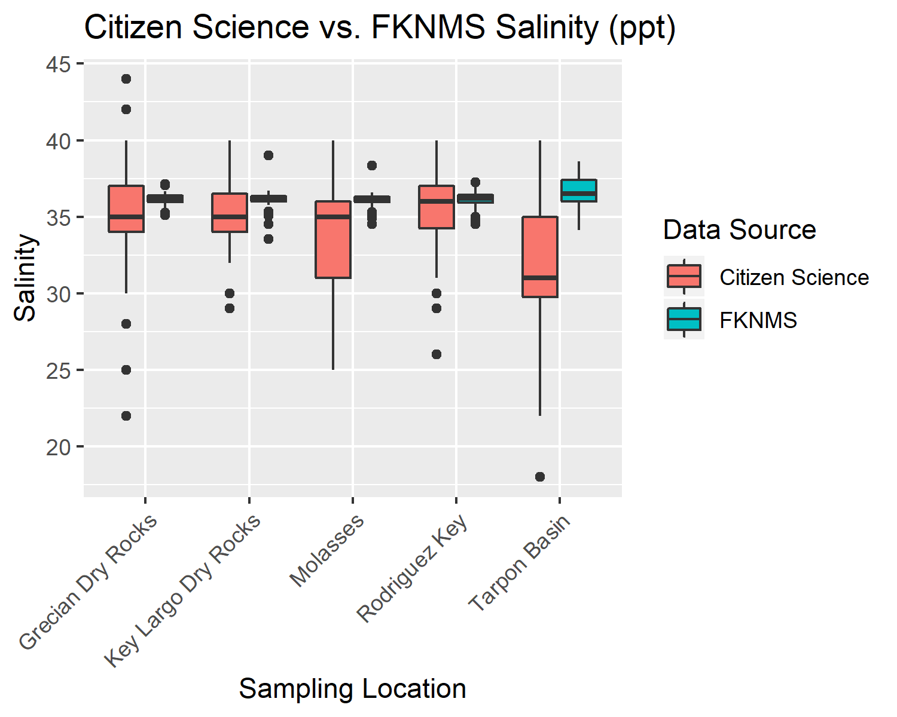
```

Comparative analysis of dissolved oxygen shows a relatively consistent pattern across both data sources. The upper limits of the interquartile range for citizen science observations is typically consistent with the median value for FKNMS data showing a small bias toward reduced dissolved oxygen levels in citizen science measures. The results of comparative dissolved oxygen analysis can be viewed in Figure 19. Comparative analysis of ammonia observations shows distinctly higher levels in measures from the FKNMS data when compared to citizen science data. The interquartile range of citizen science measures for all sites rest almost entirely at the 0 mg/L level whereas, FKNMS data shows a slightly larger range from 0-0.5 mg/L. Interestingly, the FKNMS observations show a greater number of high outliers compared to no high level outliers in the citizen science data. The results of comparative ammonia analysis can be viewed in Figure 20.  

```{r 19Fig, fig.cap="Comparative analysis of dissolved oxygen (mg/L) measures collected from citizen science data verses FKNMS data.", echo=FALSE}

```

```{r 20Fig, fig.cap="Comparative analysis of ammonia (mg/L) measures collected from citizen science data verses FKNMS data.", echo=FALSE}

```


### Unsupervised Learning Analysis
Unsupervised learning analysis used agglomerated hierarchical clustering to determine the grouping characteristics of sampling sites based exclusively on water quality parameters. The overall results of this analysis showed that clustering at the lowest levels of the dendrogram (most similar) and the highest levels of the dendrogram (least similar) were often consistent with other components of site characteristics such as: geographical location, water depth, and benthic biotic community structure. The mid-levels (moderate similarity) of the dendrograms were typically highly variable and not consistent with any known patterns of site characteristics. The total cluster analysis dendrogram split into 5 distinct clusters by water quality. The majority of coral reef site locations were clustered into a single group (purple in Figure 21). The remaining 4 clusters showed a mixture of seagrass/mangrove, patch reefs/hardbottom, and two coral reef locations. The reef site known as The Elbow was notably clustered into a group by itself. The dendrogram of all sampling sites can be viewed in Figure 21.

```{r 21Fig, fig.cap="Total Cluster Analysis Dendrogram: Agglomerative hierarchical clustering using the agnes algorithm, Ward's minimum variance, and silhouette cluster validation.", echo=FALSE}
knitr::include_graphics("../../results/Unsupervised_Modeling_Figures/sample_site_dendro_agnes.png")
```

Site type cluster analysis separated sampling locations by dominant benthic community structure to visualize patterns of grouping within types. Seagrass/mangrove cluster analysis showed a fairly diverse grouping with locations splitting into 5 clusters. Many of the related pairs were geographically close in proximity (Pelican Key & Bush Point, Tarpon Basin & Dana's Cove, El Radabob & Boat Ramp). Notably, the most geographically distant location Nest Key was clustered into a solo group. The results of seagrass/mangrove site clustering can be viewed in Figure 22. Patch reef/hardbottom cluster analysis showed the most diverse grouping of all three site types splitting into 6 clusters. All sampling locations within this subset were assigned with individual cluster groups with the exception of two: Mosquito and Higdon's. The results of patch reef/hardbottom cluster analysis can be viewed in Figure 23. Coral reef cluster analysis showed the lowest diversity splitting into 2 cluster groups. The smaller cluster (blue in Figure 24) contained the two northernmost reef sites The Elbow and Ocean Reef Club, whereas the second cluster (red in Figure 24) contained all mid-southern sites. Similarly, to seagrass/mangrove clustering closely related pairs (Horseshoe & Grecian Dry Rocks, North North Dry Rocks & Key Largo Dry Rocks) were geographically close in proximity. The results of coral reef cluster analysis can be viewed in Figure 24.


```{r 22Fig, fig.cap="Seagrass/Mangrove Site Type Cluster Analysis Dendrogram: Agglomerative hierarchical clustering using the agnes algorithm, Ward's minimum variance, and silhouette cluster validation.", echo=FALSE}
knitr::include_graphics("../../results/Unsupervised_Modeling_Figures/sg_mg_good_dend.png")
```

```{r 23Fig, fig.cap="Patch Reef/Hardbottom Site Type Cluster Analysis Dendrogram: Agglomerative hierarchical clustering using the agnes algorithm, Ward's minimum variance, and silhouette cluster validation.", echo=FALSE}
knitr::include_graphics("../../results/Unsupervised_Modeling_Figures/pr_h_good_dend.png")
```

```{r 24Fig, fig.cap="Coral Reef Site Type Cluster Analysis Dendrogram: Agglomerative hierarchical clustering using the agnes algorithm, Ward's minimum variance, and silhouette cluster validation.", echo=FALSE}
knitr::include_graphics("../../results/Unsupervised_Modeling_Figures/cr_good_dend.png")
```

Representative site seasonal cluster analysis compared the seasonal grouping of observations from each of the three representative sites (most frequently visited): Tarpon Basin as seagrass/mangrove, Rodriguez Key as patch reef/hardbottom, and Grecian Dry Rocks as a coral reef. The results of Tarpon Basin seasonal analysis produced a dendrogram with 2 clusters. All months were contained within a single cluster with the exception of October which was the only fall month included in this analysis. Additionally, the pattern of closely related pairs was consistent with seasonal groupings of the months of the year. The results of Tarpon Basin cluster analysis can be viewed in Figure 25. Rodriguez Key seasonal cluster analysis produced a dendrogram with 4 clusters. All summer months were grouped within the same cluster (purple in Figure 26) however, the remaining groups show no discernable pattern of organization. The results of Rodriguez Key cluster analysis can be seen in Figure 26. Grecian Dry Rocks seasonal cluster analysis produced a dendrogram with 3 clusters. All months were retained within a single group with the exception of July and December which seperated into solo clusters. No discernable pattern of grouping was observed within the remaining cluster (red in Figure 27). The results of Grecian Dry Rocks cluster analysis can be viewed in Figure 27. 

```{r 25Fig, fig.cap="Tarpon Basin Seasonal Cluster Analysis Dendrogram: Agglomerative hierarchical clustering using the agnes algorithm, Ward's minimum variance, and silhouette cluster validation.", echo=FALSE}
knitr::include_graphics("../../results/Unsupervised_Modeling_Figures/good_adend_tarpon.png")
```

```{r 26Fig, fig.cap="Rodriguez Key Seasonal Cluster Analysis Dendrogram: Agglomerative hierarchical clustering using the agnes algorithm, Ward's minimum variance, and silhouette cluster validation.", echo=FALSE}
knitr::include_graphics("../../results/Unsupervised_Modeling_Figures/good_adend_roddy.png")
```

```{r 27Fig, fig.cap="Grecian Dry Rocks Seasonal Cluster Analysis Dendrogram: Agglomerative hierarchical clustering using the agnes algorithm, Ward's minimum variance, and silhouette cluster validation.", echo=FALSE}
knitr::include_graphics("../../results/Unsupervised_Modeling_Figures/good_adend_grecian.png")
```

In addition to seasonal clustering, a year-to-year comparison of replicate sampling sites was analyzed with cluster analysis to compare the reproducibility of previous grouping patterns to each other. The results of this analysis were inconclusive due to limitations of the data collection and modeling techniques used. The results of this analysis can be found within the supplementary materials.

# Discussion

## Summary and Interpretation
The analysis of the MarineLab citizen science data shows the overall trends of water quality parameters in the greater Key Largo waters, investigates seasonal and location specific trends of the sampling locations, and evaluates the efficacy of the water quality measurements collected through this monitoring program. Location-based analyses showed that salinity and temperature ranges were typically narrower than the ranges observed for bayside sites. This pattern is likely due to the physical structure of the bay compared to the ocean. The bayside waters are substantially smaller and shallower than ocean side waters, and thus are far more likely to be influenced by seasonal temperature fluctuation and freshwater input[@Fourqurean1999;@Kruczynski2012]. Additionally, the Florida bay receives a substantial volume of freshwater input directly from the sheet flow of the Everglades which further exacerbates salinity differences between the two island sides[@Fourqurean1999;@Kruczynski2012]. Regarding dissolved oxygen, ammonia, and pH levels measured in this study, no consistent pattern of differences was seen between the two island sides. This pattern is unsurprising for dissolved oxygen and pH measures as these variables do not typically fluctuate substantially within stable ecosystems[REF]. The lack of ammonia difference is surprising due to the fact that shallower turbid waters, such as in the bayside, typically hold a greater nutrient content than clear waters of the oceanside[@Rudnick1999;@Kruczynski2012]. This lack of ammonia is likely due to bias introduced by the sampling specificity of the equipment used in the citizen science program. This pattern is evident in the ammonia trends of FKNMS data seen in the efficacy analysis (Figure 20). Site type analyses showed similar patterns to island side analyses in terms of temperature and salinity ranges. Coral reefs were associated with stenohaline and stenothermal waters, whereas seagrass/mangroves were euryhaline and eurythermal. Patch reefs/hardbottom sites typically expressed a abiotic condition range similar to that of coral reefs however, the average measure of temperature was found to be greater than coral reefs. This is likely due to a sampling bias as patch reefs/hardbottom sites are often unsafe to visit in the winter months due to strong winds thus skewing the data towards warmer temperatures. 

Seasonal analyses showed little fluctuation in any of the water quality parameters with the exception of water temperature. Water temperature patterns were consistent with the rise and fall of average temperatures in association with winter and summer months. The lack of seasonal bayside variation of salinity was surprising due to the fact that the bay is strongly influenced by the occurrences of the wet and dry seasons in the Florida Keys which increases/decreases the flow of freshwater into the system [REF]. Targeted analysis of the effects of Hurricane Irma showed a significant decrease in water salinity and a significant increase in ammonia levels immediately following the landfall of the storm. The change in salinity is likely due to the heavy rainfall and freshwater flooding associated with the storm system which drains primarily into the bayside waters; the greater depth and size of oceanside water renders these effects minimal which explains the lack of change noted in these locations [REF]. The change in ammonia levels is likely due to the large nutrient influx brought about with the storm surge and benthic disturbance [REF]. The lack of change in dissolved oxygen levels is likely due to the fact that sampling immediately following the storm did not occur due to unsafe marine conditions allowing oxygen levels to normalize before more data could be collected. Water temperature and pH do not show any changes beyond the values of standard and/or seasonal fluctuation. 

Citizen science efficacy analysis compared the citizen science dataset to data collected through the FKNMS water quality monitoring program. This analysis showed that citizen science data agreed with the broad patterns of water quality measures seen in the FKNMS data. Citizen science salinity measures showed a substantially larger interquartile range of values as well as a slight bias towards reduced ammonia levels. These two discrepancies are likely due to the technological sensitivity of the materials used to collect data between the two programs. Additionally, citizen science data showed a greater level of extreme outliers likely due to the inexperience of some students. The results of this analysis suggest that well maintained/trained citizen science data collection is an effective method to capture the broad-scale water quality trends of a region. The results also suggest that citizen science monitoring is likely to introduce some inherent biases due to technological, skill, and/or training limitations and is thus not recommended for research requiring highly accurate water quality measures. 

Unsupervised hierarchical cluster analysis was used to identify the grouping patterns of location and seasonal data to determine site similarity and/or dissimilarity. Overall, clustering patterns at the lowest levels (small bins or pairs) of the dendrograms were often associated with sites which had similar geographical, depth, and/or biotic characteristics whereas; the highest cluster levels (large clusters) were often associated with major location categories such as island side or site type. Total cluster analysis showed a loose grouping of locations by island side however, these results we not consistent across all locations. Site type cluster analysis showed a diverse clustering (greater optimal cluster number) for patch reefs/hardbottom and seagrass/mangrove sites. This result suggests that patch reef/hardbottom and seagrass/mangrove sites are more dynamic in terms of abiotic water conditions than coral reef sites. This result is consistent with previous location-based analyses. Seasonal cluster analysis showed the monthwise grouping of observations from Tarpon Basin, Rodriguez Key, and Grecian Dry Rocks. The results of this analysis showed that observations grouped seasonally (similar calendar months) at Tarpon Basin, moderately seasonally at Rodriguez Key, and minimally seasonally at Grecian Dry Rocks. This suggests that seagrass/mangrove sites may be more strongly influenced by seasonal fluctuation in abiotic conditions compared to patch reefs/hardbottom and coral reefs. This is consistent with the abiotic range and seasonal fluctuations observed within previous analyses. 


## Strengths and Limitations
The analysis of the MarineLab citizen science water quality data shows the utility of citizen science monitoring as a tool for the mass collection of data. The greatest strength of this analysis was the successful characterization of broad-scale water quality patterns of Key Largo, Florida. Citizen science data was able to capture the general trends of water conditions based on location, season, and hurricane effects. These data show the value of citizen science monitoring as an effective tool to gather information on the local environment. This strength is supported by the citizen science efficacy analysis which showed highly similar large-scale trends in water quality conditions when compared to sanctuary data. Despite this strength, this analysis shows citizen science data is limited by accuracy and is thus not recommended for research requiring highly accurate parameter measures.

Additional limitations are attributable to analysis methodology and sampling bias in the site selection. The citizen science monitoring dataset is highly influenced by seasonal availability of site access. Sample collection is dependent on the demand of enrolled citizen scientists and safe availability of site locations. As a result, a sampling bias is introduced into this dataset due to the irregular pattern of student enrollment which strongly favors spring and fall months (aligned with the typical school calendar year). Site bias is introduced due to the inaccessibility of some locations due to unsafe weather conditions. This creates a situation where specific sites (primarily patch reefs/hardbottom) are only successfully sampled during calmer months of the year creating a bias in parameters which are seasonally influenced. These biases are notable in the various analyses preformed throughout this study and should be cautiously interpreted. Results for the month of August were frequently omitted or had the fewest number of observations due to regular facility closure at this time of the year. Additionally, the results of Hurricane Irma analysis may not show the entire extent of abiotic storm effects due to the inaccessibility of site locations immediately following storm landfall. 

Unsupervised learning analysis successfully illustrated the clustering patterns of location and seasonal data based on water quality parameters however, this analysis method severely limits the applicability of conclusions that can be drawn. Unsupervised learning models group the data by the predictor values but does not provide any information as to why the grouping is arranged in a particular fashion. Inferences explaining grouping characteristics were proposed in the discussion of this study however, these inferences are based on the general pattern of the cluster groups and are prone to interpretation. As a result, we suggest that cluster analysis is an appropriate method to investigate the general clustering patterns and develop initial hypotheses however, further research will be required to confirm the mechanistic features driving clustering beyond the scope of citizen science data analysis. 

## Conclusions
The results of this study suggest that citizen science data collection is an applicable method for the characterization and monitoring of broad-scale water quality parameters in the waters of the Florida Keys. Abiotic condition analysis suggests that bayside sampling locations are dynamic in terms of water temperature and salinity whereas, oceanside sites are show a narrower abiotic condition range for these two parameters. Site type investigation revealed that seagrass/mangrove sites show dynamic abiotic condition ranges whereas, coral reefs and patch reefs/hardbottom sites are typically less variable. Seasonal analyses suggest that water temperature is strongly influenced by seasonal patterns showing cooler water temperatures in association with winter months and warmer temperatures in the summer months. These results are more strongly notable in bayside site locations. Comparative efficacy analysis showed similar broad patterns in water quality condition across both datasets suggesting that citizen science data collection is an effective method for the visualization of broad-scale trends but is limited by sampling expertise and equipment specificity. Hierarchical cluster analysis of water quality condition suggests that highly similar sites also  show similarity in geographic distance, water depth, and dominant benthic biota. Larger clustering patterns show general trends toward major categories of site locations (island side or site type) however, this pattern was not consistent across all observations. Site type analysis suggest that patch reefs/hardbottom and seagrass/mangrove sites are relatively distinct within the individual subgroups whereas, coral reef sites are less variable. Seasonal cluster analysis suggests that seagrass/mangrove sites are more strongly influenced by seasonal water quality fluctuation compared to coral reefs and patch reefs/hardbottom sites which show not patterns of seasonal clustering. 

## Supplemental Information
All raw data, processing scripts, analysis scripts, figures, and manuscript products can be found within the GitHub repository for this project at: [https://github.com/epid8060fall2019/William-Norfolk-Project](https://github.com/epid8060fall2019/William-Norfolk-Project).

Supplemental figures and tables can be found within the supplementary materials script located in the project repository.

FKNMS water quality metadata can be accessed at: [http://ocean.floridamarine.org/FKNMS_wqpp/waterQualityNew.htm](http://ocean.floridamarine.org/FKNMS_wqpp/waterQualityNew.htm).

# References

